<div align="center">
  <h1>Build ETL Data Pipelines with BashOperator using Apache Airflow</h1>  
  
  
  
</div>

## Project Scenario
You are a data engineer at a data analytics consulting company. You have been assigned a project to decongest the national highways by analyzing the road traffic data from different toll plazas. Each highway is operated by a different toll operator with a different IT setup that uses different file formats. Your job is to collect data available in different formats and consolidate it into a single file.

## Exercise 1: Create imports, DAG argument, and definition
### Task 1.1
1. Create a new file named `ETL_toll_data.py` in `/home/project` directory and open it in the file editor.
2. Import all the packages you need to build the DAG.
3. Define the DAG arguments as per the following details in the `ETL_toll_data.py` file:

| Parameter  | Value |
| ------------- | ------------- |
| owner  | \<You may use any dummy email> |
| start_date  | today  |
| email  | \<You may use any dummy email> |
| email_on_failure | True  |
| email_on_retry  | True |
| retries  | 1 |
| retry_delay | 5 minutes  |

:ballot_box_with_check: ***Solution:***  
<kbd>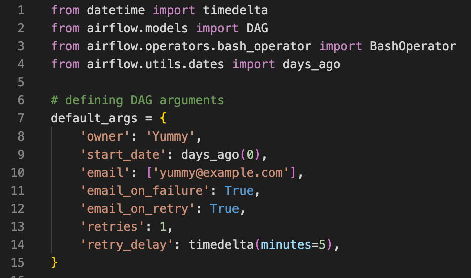</kbd>

### Task 1.2
Define the DAG in the `ETL_toll_data.py` file using the following details.

| Parameter  | Value |
| ------------- | ------------- |
| DAG id  | `ETL_toll_data` |
| Schedule  | Daily once  |
| default_args  | As you have defined in the previous step |
| description | Apache Airflow Final Assignment  |

:ballot_box_with_check: ***Solution:***  
<kbd>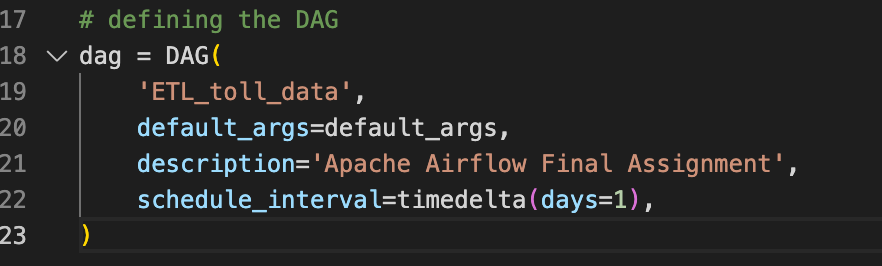</kbd>

## Exercise 2: Create the tasks using BashOperator
### Task 2.1
Create a task named `unzip_data` to unzip data. Use the data downloaded in the first part of this assignment in `Set up the lab environment` and uncompress it into the destination directory using `tar`.

:ballot_box_with_check: ***Solution:***  
<kbd>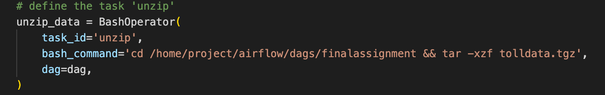</kbd>

### Task 2.2
Create a task named `extract_data_from_csv` to extract the fields `Rowid`, `Timestamp`, `Anonymized Vehicle number`, and `Vehicle type` from the `vehicle-data.csv` file and save them into a file named `csv_data.csv`.

:ballot_box_with_check: ***Solution:***  
<kbd>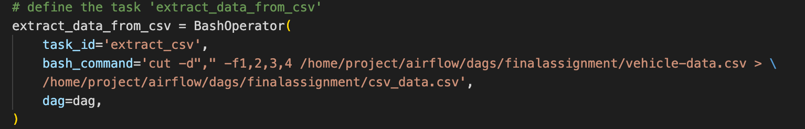</kbd>

### Task 2.3
Create a task named `extract_data_from_tsv` to extract the fields `Number of axles`, `Tollplaza id`, and `Tollplaza code` from the `tollplaza-data.tsv` file and save it into a file named `tsv_data.csv`.

:ballot_box_with_check: ***Solution:***  
<kbd>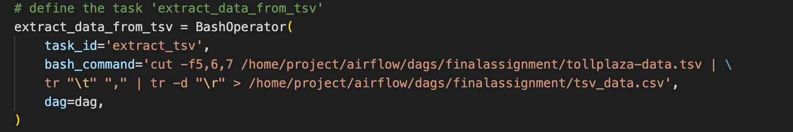</kbd>

### Task 2.4
Create a task named `extract_data_from_fixed_width` to extract the fields `Type of Payment code`, and `Vehicle Code` from the fixed width file `payment-data.txt` and save it into a file named `fixed_width_data.csv`.

:ballot_box_with_check: ***Solution:***  
<kbd>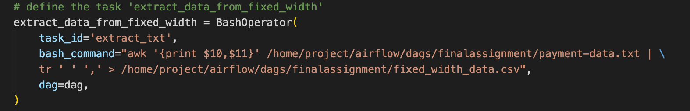</kbd>

### Task 2.5
Create a task named `consolidate_data` to consolidate data extracted from previous tasks. This task should create a single csv file named `extracted_data.csv` by combining data from the following files:  
- `csv_data.csv`
- `tsv_data.csv`
- `fixed_width_data.csv`

The final csv file should use the fields in the order given below:
- `Rowid`
- `Timestamp`
- `Anonymized Vehicle number`
- `Vehicle type`
- `Number of axles`
- `Tollplaza id`
- `Tollplaza code`
- `Type of Payment code`, and
- `Vehicle Code`
 
> **Example**  
> `paste file1 file2 > newfile`

:ballot_box_with_check: ***Solution:***  
<kbd>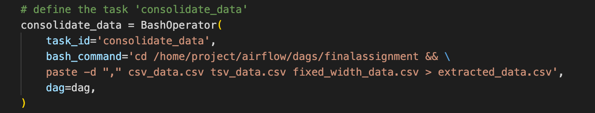</kbd>

### Task 2.6
Create a task named `transform_data` to transform the vehicle_type field in `extracted_data.csv` into capital letters and save it into a file named `transformed_data.csv` in the staging directory.

:ballot_box_with_check: ***Solution:***  
<kbd>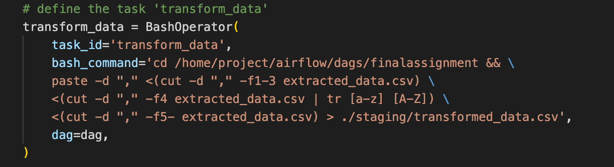</kbd>

### Task 2.7
Define the task pipeline as per the details given below:

|Task |	Functionality |
| :------------ | :------------ |
First task |	unzip_data
Second task |	extract_data_from_csv
Third task |	extract_data_from_tsv
Fourth task |	extract_data_from_fixed_width
Fifth task |	consolidate_data
Sixth task |	transform_data


:ballot_box_with_check: ***Solution:***  
<kbd>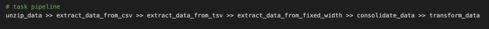</kbd>

## Exercise 3: Getting the DAG operational
### Task 3.1
Submit the DAG. Use CLI or Web UI to show that the DAG has been properly submitted.
```
airflow dags list-import-errors
```

:ballot_box_with_check: ***Solution:***  
<kbd>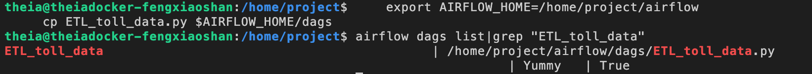</kbd>

### Task 3.2
Unpause and trigger the DAG through CLI or Web UI. 

:ballot_box_with_check: ***Solution:***  
<kbd>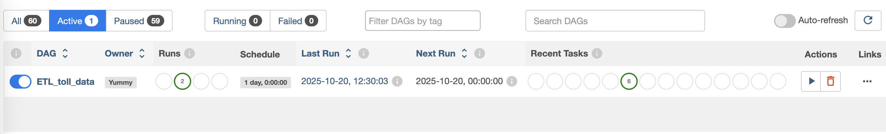</kbd>

### Task 3.3
Observe tasks in the DAG run through CLI or Web UI.

:ballot_box_with_check: ***Solution:***  
<kbd>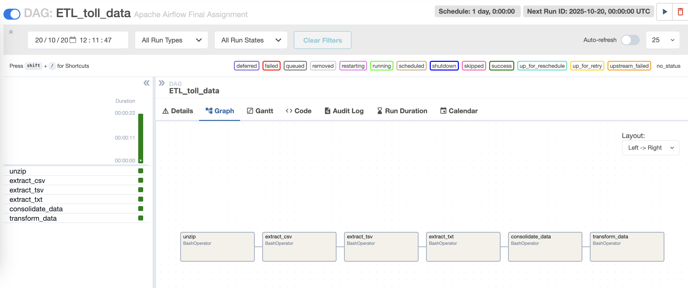</kbd>

### Task 3.4
Observe DAG runs for the Airflow console through CLI or Web UI.

:ballot_box_with_check: ***Solution:***  
<kbd>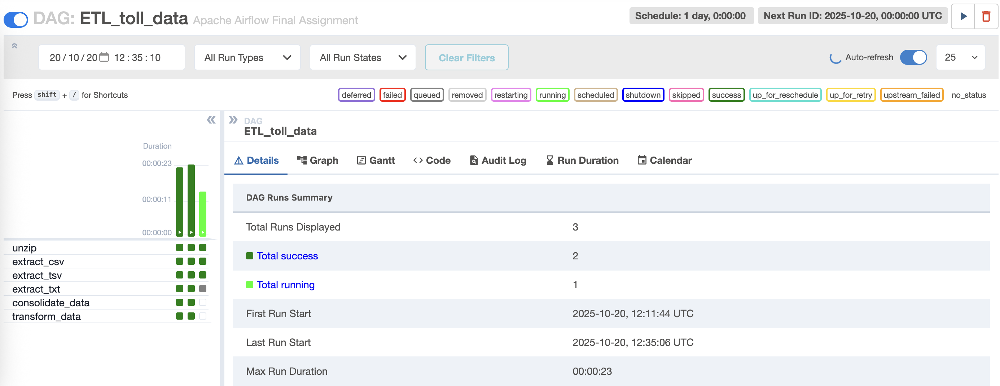</kbd>

