<div align="center">
  <h1>Data Analysis using Spark</h1>  
  
  
  
</div>

## Project Scenario
You have been tasked by the HR department of a company to create a data pipeline that can take in employee data in a CSV format. Your responsibilities include analyzing the data, applying any required transformations, and facilitating the extraction of valuable insights from the processed data.
Given your role as a data engineer, you've been requested to leverage Apache Spark components to accomplish the tasks.  
This project is completed in a Jupyter Notebook environment.

## Prerequisites
1. For this lab assignment, you will be using Python and Spark (PySpark). Therefore, it's essential to make sure that the following libraries are installed in your lab environment or within Skills Network (SN) Labs.
```sh
# Installing required packages
!pip install pyspark  findspark wget
```
```py
import findspark

findspark.init()
```
```py
# PySpark is the Spark API for Python. In this lab, we use PySpark to initialize the SparkContext.

from pyspark import SparkContext, SparkConf

from pyspark.sql import SparkSession
```
```py
# Creating a SparkContext object  

sc = SparkContext.getOrCreate()

# Creating a SparkSession  

spark = SparkSession \
    .builder \
    .appName("Python Spark DataFrames basic example") \
    .config("spark.some.config.option", "some-value") \
    .getOrCreate()
```

2. Download the CSV data.
```py
# Download the CSV data first into a local `employees.csv` file
import wget
wget.download("https://cf-courses-data.s3.us.cloud-object-storage.appdomain.cloud/IBM-BD0225EN-SkillsNetwork/data/employees.csv")
```

## Tasks
### Task 1: Generate a Spark DataFrame from the CSV data
Read data from the provided CSV file, `employees.csv` and import it into a Spark DataFrame variable named `employees_df`.

:ballot_box_with_check: ***Solution:***  
```py
# Read data from the "emp" CSV file and import it into a DataFrame variable named "employees_df"  
employees_df = spark.read.csv('employees.csv', header=True, inferSchema=True)
```
<kbd>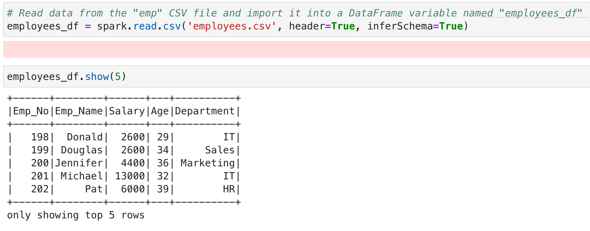</kbd>

### Task 2: Define a schema for the data
Construct a schema for the input data and then utilize the defined schema to read the CSV file to create a DataFrame named `employees_df`.  

:ballot_box_with_check: ***Solution:***  
```py
from pyspark.sql.types import StructType, StructField, StringType, LongType
# Define a Schema for the input data and read the file using the user-defined Schema
schema = StructType([
    StructField('Emp_No', LongType(), True),
    StructField('Emp_Name', StringType(), True),
    StructField('Salary', LongType(), True),
    StructField('Age', LongType(), True),
    StructField('Department', StringType(), True)
])
employees_df = spark.read.csv('employees.csv', header=True, schema=schema)
employees_df.show(5)
```
<kbd>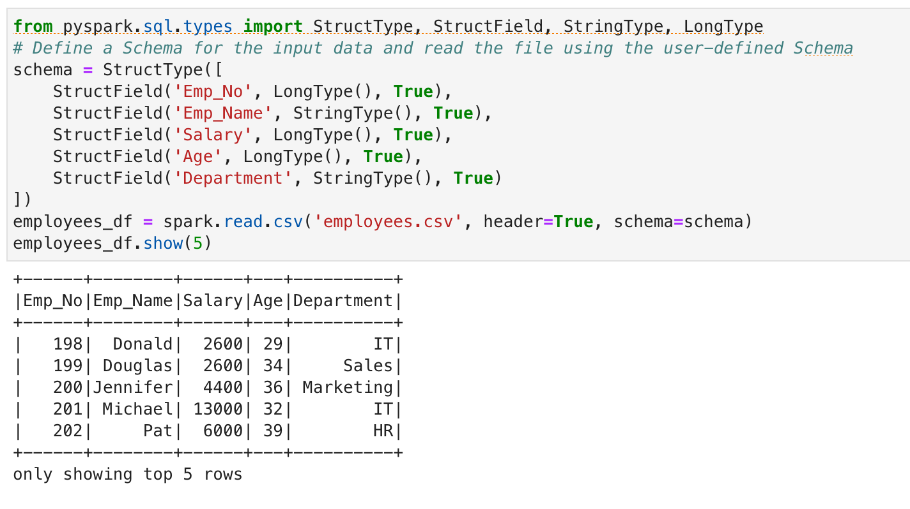</kbd>

### Task 3: Display schema of DataFrame
Display the schema of the `employees_df` DataFrame, showing all columns and their respective data types.  

:ballot_box_with_check: ***Solution:***  
```py
# Display all columns of the DataFrame, along with their respective data types
employees_df.printSchema()
```
<kbd>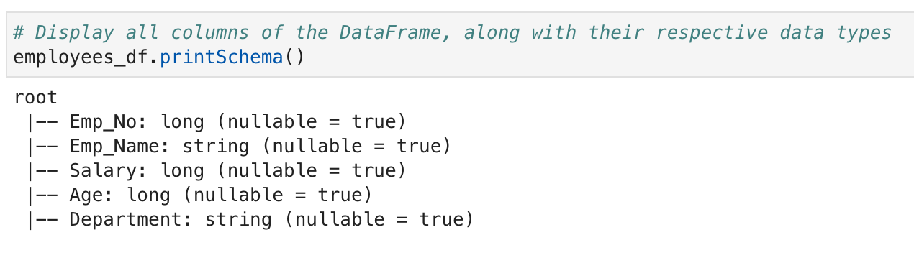</kbd>

### Task 4: Create a temporary view
Create a temporary view named `employees` for the `employees_df` DataFrame, enabling Spark SQL queries on the data.

:ballot_box_with_check: ***Solution:***  
```py
# Create a temporary view named "employees" for the DataFrame
employees_df.createTempView('employees')
```
<kbd>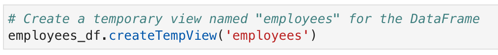</kbd>

### Task 5: Execute an SQL query
Compose and execute an SQL query to fetch the records from the `employees` view where the age of employees exceeds 30. Then, display the result of the SQL query, showcasing the filtered records.

:ballot_box_with_check: ***Solution:***  
```py
# SQL query to fetch solely the records from the View where the age exceeds 30
spark.sql('SELECT * FROM employees WHERE Age > 30').show()
```
<kbd>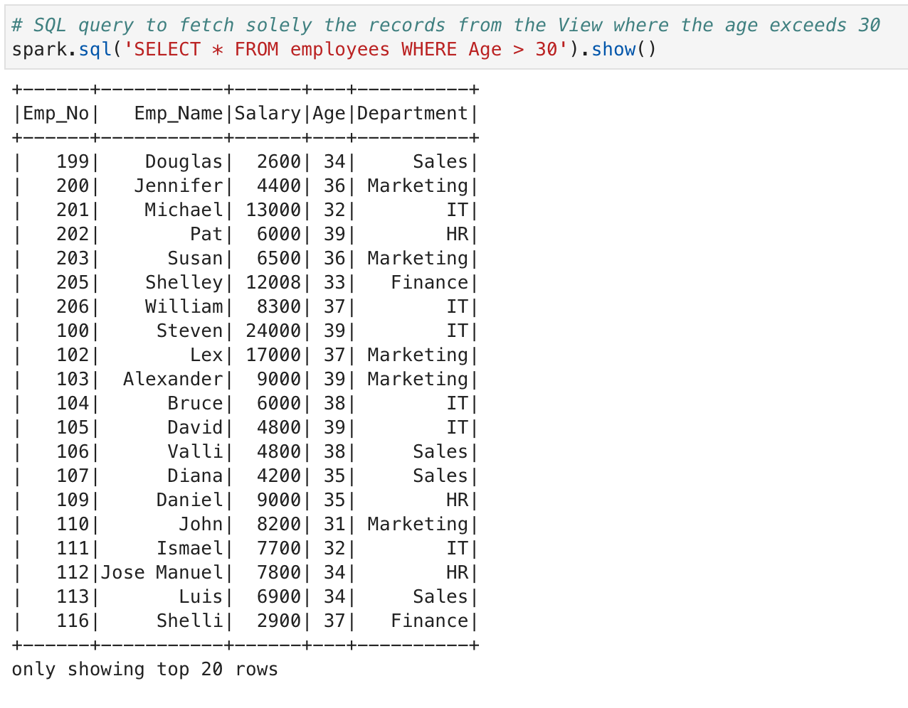</kbd>

### Task 6: Calculate Average Salary by Department
Compose an SQL query to retrieve the average salary of employees grouped by department. Display the result.

:ballot_box_with_check: ***Solution:***  
```py
# SQL query to calculate the average salary of employees grouped by department
spark.sql('SELECT Department, AVG(Salary) FROM employees GROUP BY Department').show()
```
<kbd>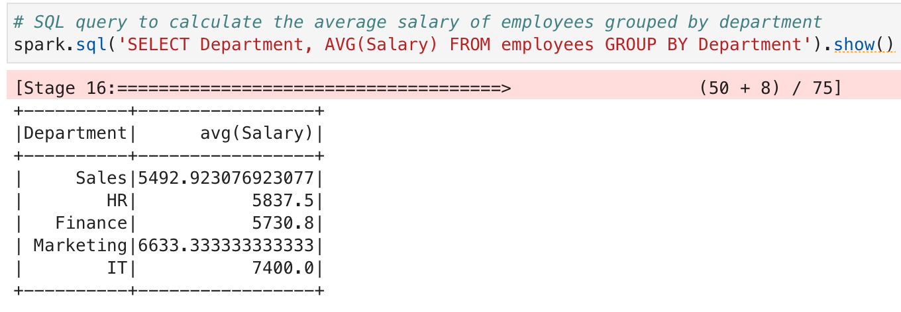</kbd>

### Task 7: Filter and Display IT Department Employees
Apply a filter on the `employees_df` DataFrame to select records where the department is `'IT'`. Display the filtered DataFrame.

:ballot_box_with_check: ***Solution:***  
```py
# Apply a filter to select records where the department is 'IT'
filtered_df = employees_df.filter('Department = "IT"')
filtered_df.show()
```
<kbd>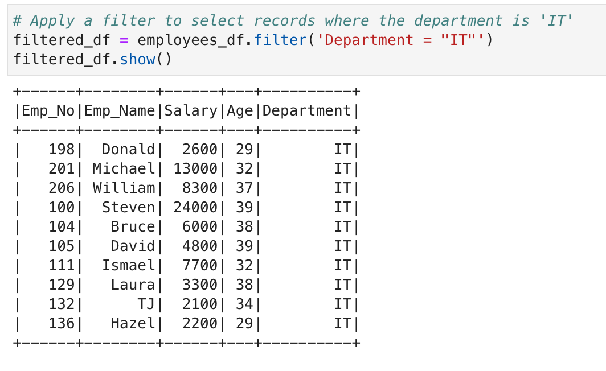</kbd>

### Task 8: Add 10% Bonus to Salaries
Perform a transformation to add a new column named "SalaryAfterBonus" to the DataFrame. Calculate the new salary by adding a 10% bonus to each employee's salary.

:ballot_box_with_check: ***Solution:***  
```py
from pyspark.sql.functions import col

# Add a new column "SalaryAfterBonus" with 10% bonus added to the original salary
employees_df=employees_df.withColumn('SalaryAfterBonus', col('Salary')*1.1)
employees_df.show()
```
<kbd>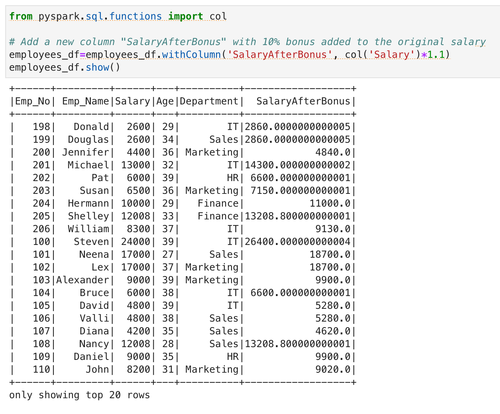</kbd>

### Task 9: Find Maximum Salary by Age
Group the data by age and calculate the maximum salary for each age group. Display the result.

:ballot_box_with_check: ***Solution:***  
```py
from pyspark.sql.functions import max

# Group data by age and calculate the maximum salary for each age group
max_salary_age = employees_df.groupBy('Age').agg(max('Salary').alias('MaxSalary'))
max_salary_age.show()
```
<kbd>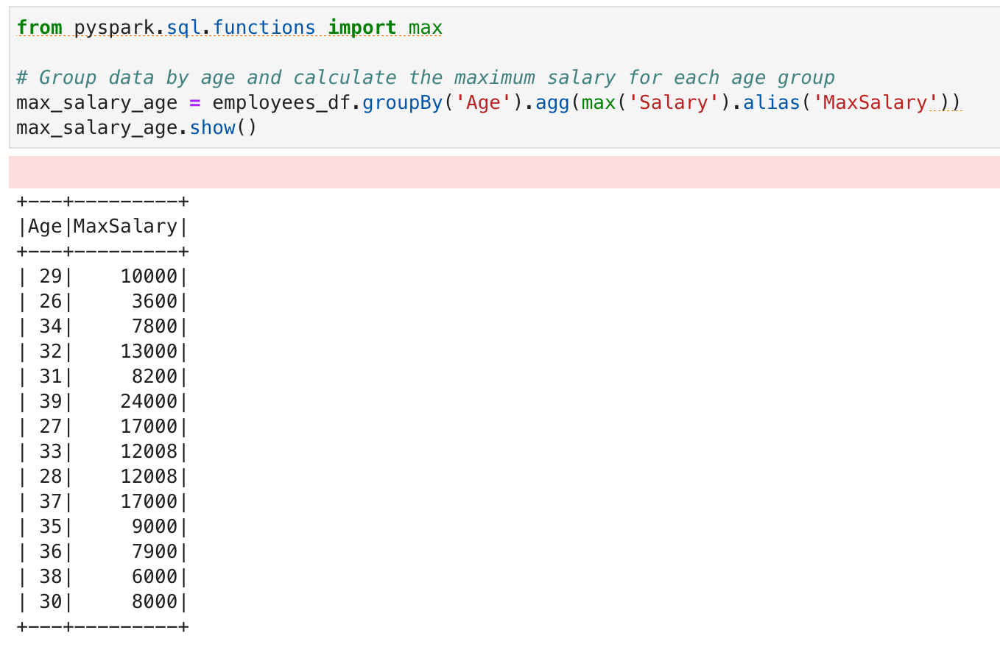</kbd>

### Task 10: Self-Join on Employee Data
Join the `employees_df` DataFrame with itself based on the "Emp_No" column. Display the result.

:ballot_box_with_check: ***Solution:***  
```py
# Join the DataFrame with itself based on the "Emp_No" column
joined_df = employees_df.join(employees_df, 'Emp_No')
joined_df.show()
```
<kbd>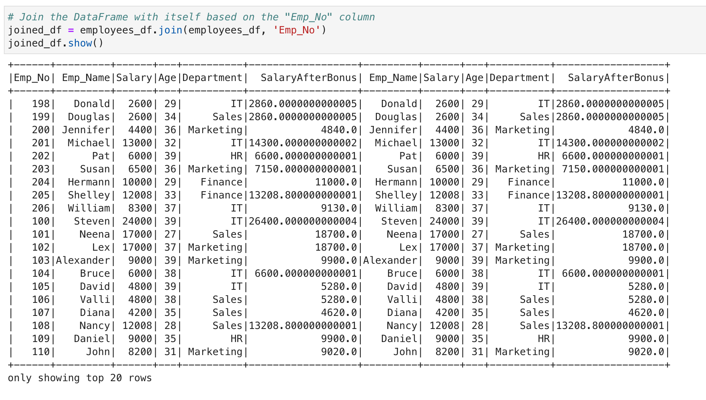</kbd>

### Task 11: Calculate Average Employee Age
Calculate the average age of employees using the built-in aggregation function. Display the result.

:ballot_box_with_check: ***Solution:***  
```py
# Calculate the average age of employees
from pyspark.sql.functions import avg 
employees_df.agg(avg('Age')).show()
```
<kbd>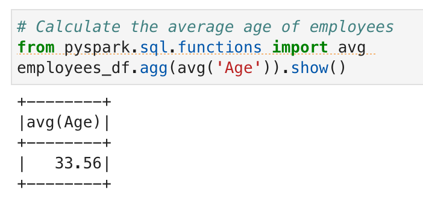</kbd>

### Task 12: Calculate Total Salary by Department
Calculate the total salary for each department using the built-in aggregation function. Display the result.

:ballot_box_with_check: ***Solution:***  
```py
# Calculate the total salary for each department. Hint - User GroupBy and Aggregate functions
from pyspark.sql.functions import sum 
employees_df.groupBy('Department').agg(sum('Salary').alias('TotalSalary')).show()
```
<kbd>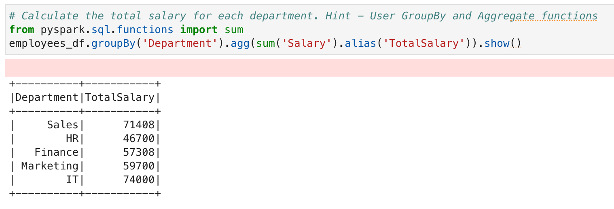</kbd>

### Task 13: Sort Data by Age and Salary
Apply a transformation to sort the DataFrame by age in ascending order and then by salary in descending order. Display the sorted DataFrame.

:ballot_box_with_check: ***Solution:***  
```py
# Sort the DataFrame by age in ascending order and then by salary in descending order
employees_df.orderBy(col('Age').asc(), col('Salary').desc()).show()
```
<kbd>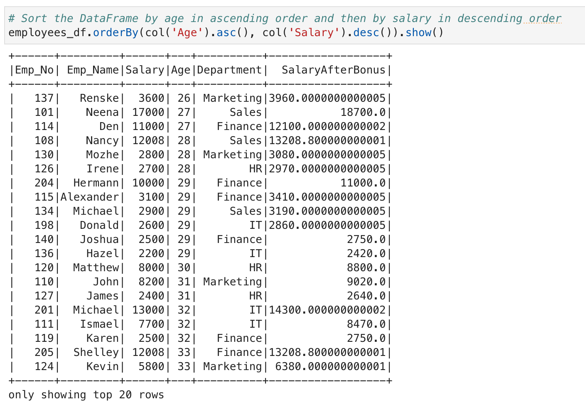</kbd>

### Task 14: Count Employees in Each Department
Calculate the number of employees in each department. Display the result.

:ballot_box_with_check: ***Solution:***  
```py
from pyspark.sql.functions import count

# Calculate the number of employees in each department
employees_df.groupBy('Department').count().show()
```
<kbd>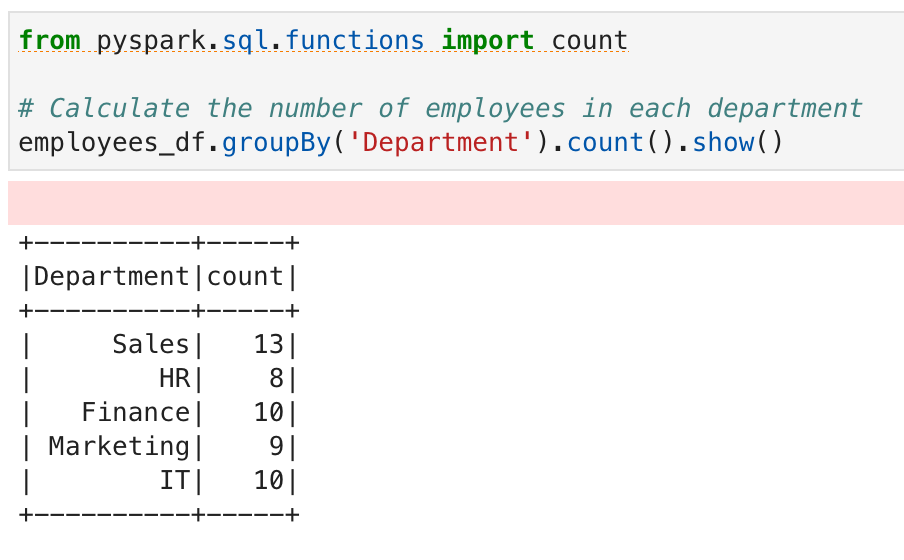</kbd>

### Task 15: Filter Employees with the letter o in the Name
Apply a filter to select records where the employee's name contains the letter `'o'`. Display the filtered DataFrame.

:ballot_box_with_check: ***Solution:***  
```py
# Apply a filter to select records where the employee's name contains the letter 'o'
employees_df.filter(col('Emp_Name').contains('o')).show()
```
<kbd>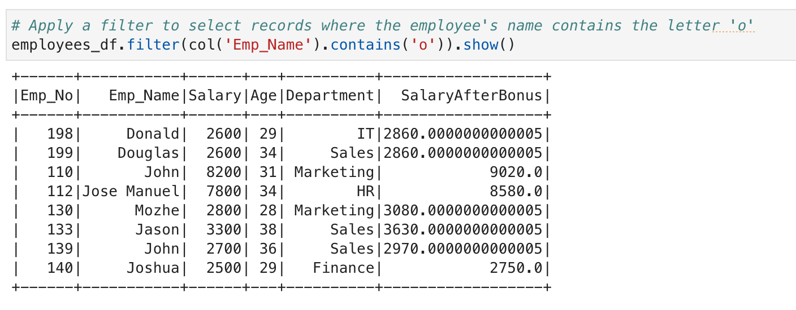</kbd>


