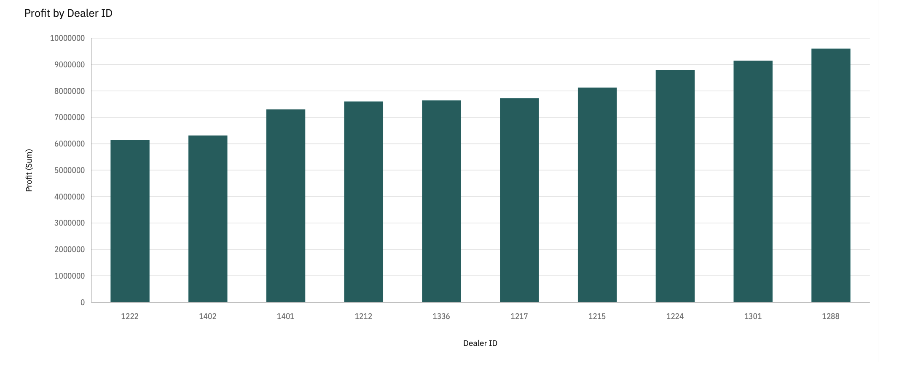
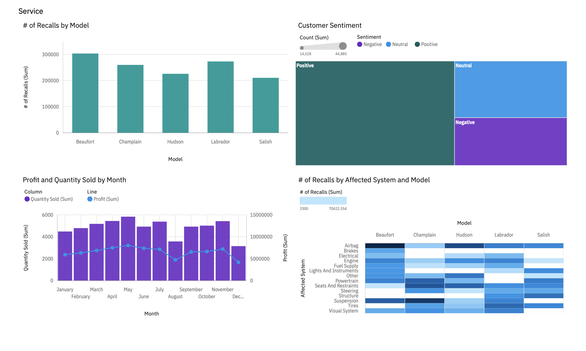

  <h1>Visualizations with IBM Cognos Analytics</h1>  

## Project Scenario
You have been hired by SwiftAuto Traders, a chain of car dealerships, as a data scientist. Your first task is to analyze car sales and profits for each dealer. You need to create some visualizations and present them as a dashboard/report to your regional manager for better understanding on car sales and profits for each dealer.

## About the dataset
The dataset used in this lab comes from [here](https://accelerator.ca.analytics.ibm.com/bi/?utm_source=skills_network&utm_content=in_lab_content_link&utm_id=Lab-IBMSkillsNetwork-DV0130EN-Coursera&perspective=authoring&pathRef=.public_folders%2FIBM%2BAccelerator%2BCatalog%2FContent%2FDAT00142&id=i22898C2A4DD748F79E0FC2BD017F4FE8&objRef=i22898C2A4DD748F79E0FC2BD017F4FE8&action=run&format=HTML&cmPropStr=%7B%22id%22%3A%22i22898C2A4DD748F79E0FC2BD017F4FE8%22%2C%22type%22%3A%22reportView%22%2C%22defaultName%22%3A%22DAT00142%22%2C%22permissions%22%3A%5B%22execute%22%2C%22read%22%2C%22traverse%22%5D%7D) in the IBM Accelerator Catalog. The Terms of use for such are located at https://developer.ibm.com/terms/ibm-developer-terms-of-use/.  

We are using a modified subset of that dataset for the lab, so to follow the lab instructions successfully, please use the dataset provided with the lab, rather than the dataset from the original source.

### Task 1
Create a dashboard/report page titled as **Sales** to capture the following KPI metrics: 
- Capture **Profit** (formatted to 1 decimal place in millions of US dollars)
- Capture **Quantity sold**
- Create a bar chart to capture **Quantity sold by model**
- Capture **Average quantity sold**

:ballot_box_with_check: ***Solution:***  
<kbd></kbd>

## Task 2 
Develop a column chart to display *Profit* by *Dealer ID* in the **Sales** dashboard/report page sorted in ascending order.

:ballot_box_with_check: ***Solution:***  
<kbd></kbd>

### Task 3
Create another dashboard/report page titled as **Service** and capture the following KPI metrics as visualizations:
- Create a column chart to capture the number of recalls per model of car 
- Create a treemap to capture the customer sentiment by comparing positive, neutral, and negative reviews
- Create a line and column chart to capture the quantity of cars sold per month compared to the profit
- Create a heatmap (in Cognos) / Pivot table with heatmap (in Looker) to capture the number of recalls by model and affected system

:ballot_box_with_check: ***Solution:***  
<kbd></kbd>

### Task 4
Export the dashboard/report as a PDF.
