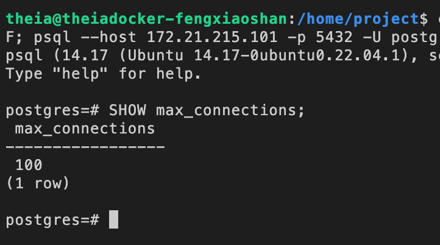
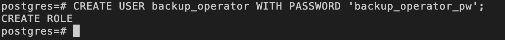
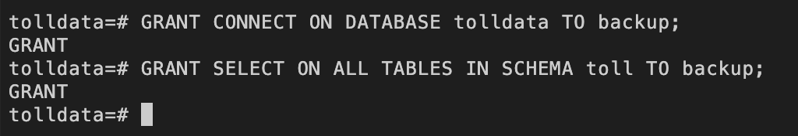
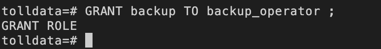
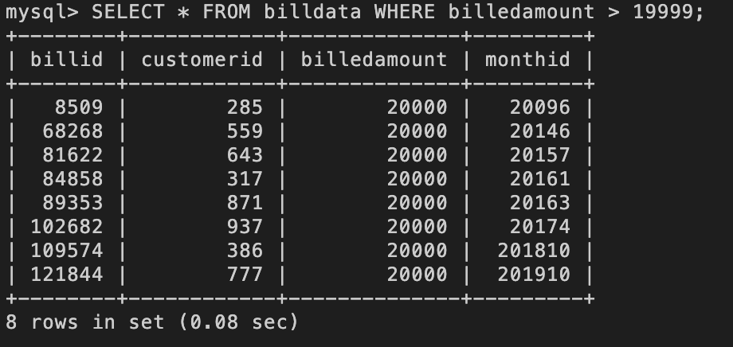
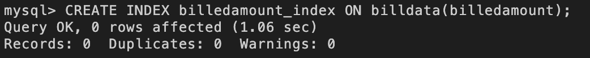
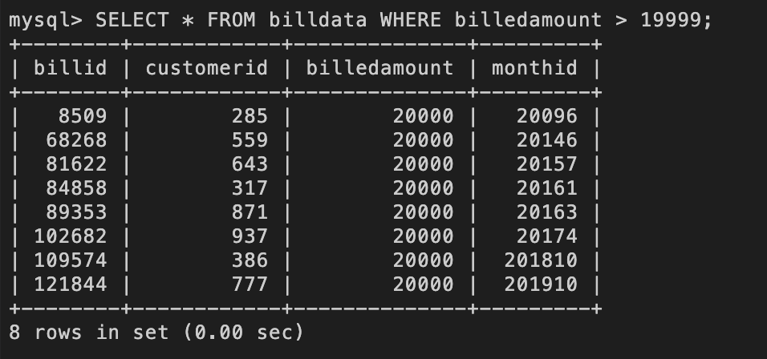
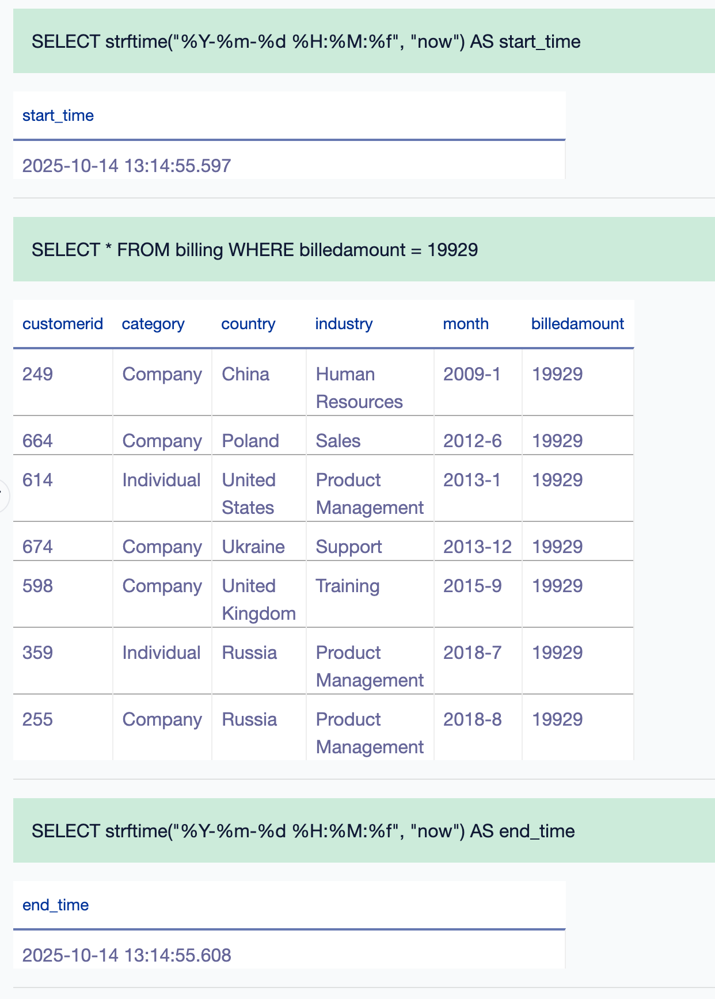
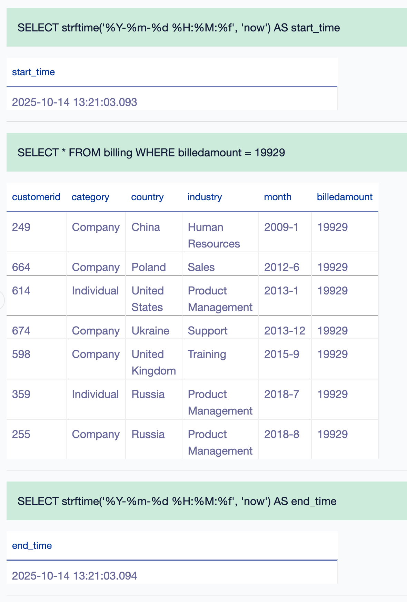

  <h1>Database Administration Project</h1>  
  
  

## Project Scenario
For this project you will assume the role of database administrator at a data analytics consulting company. You have been assigned to a project where you need to setup, test and optimize the data platform.  The platform includes various on-premises database servers like MySQL, PostgreSQL, and an open-source tool such as Datasette.  Your job is to configure, tune, secure, backup and monitor those databases and keep them running at peak performance.

## Part 1 PostgreSQL Administration
### Exercise 1.1 - Set up the lab environment
#### Task 1.1 - Find the settings in PostgreSQL
What is the maximum number of connections allowed for the postgres server on theia lab?

:ballot_box_with_check: ***Solution:***  
<kbd></kbd>

### Exercise 1.2 - User Management 
Perform these user management tasks on your PostgreSQL server.
Perform the tasks 1.2 to 1.5 using the PostgreSQL CLI. 
#### Task 1.2 - Create a User
Create a user named `backup_operator`.

:ballot_box_with_check: ***Solution:***  
<kbd></kbd>

#### Task 1.3 - Create a Role
Create a role named `backup`.

:ballot_box_with_check: ***Solution:***  
<kbd></kbd>

#### Task 1.4 - Grant privileges to the role
Grant the following privileges to the `backup` role.
- CONNECT ON DATABASE tolldata .
- SELECT ON ALL TABLES IN SCHEMA toll.

:ballot_box_with_check: ***Solution:***  
<kbd></kbd>

#### Task 1.5 - Grant role to an user
Grant the role `backup` to `backup_operator`.

:ballot_box_with_check: ***Solution:***  
<kbd></kbd>

### Exercise 1.3 - Backup 
#### Task 1.6 - Backup a database on PostgreSQL server
Backup the database `tolldata` using PGADMIN GUI.  
Backup the database `tolldata` into a file named `tolldatabackup.tar`, select the backup format as `Tar`.

:ballot_box_with_check: ***Solution:***  
<kbd></kbd>

## Part 2 MySQL Administration
### Exercise 2.1 - Set up the lab environment
Start the MySQL Server.
### Exercise 2.2 - Recovery 
#### Task 2.2.1- Restore MySQL server using a previous backup
Restore the backup file onto MySQL server. List the tables in the `billing` database.

:ballot_box_with_check: ***Solution:***  
<kbd></kbd>

#### Task 2.2.2 - Find the table data size
Find the data size of the table billdata.

:ballot_box_with_check: ***Solution:***  
<kbd></kbd>

### Exercise 2.3 - Indexing 
#### Task 2.3.1 - Baseline query performance
Write a query to select all rows with a billedamount > 19999 in table billdata.

:ballot_box_with_check: ***Solution:***  
<kbd></kbd>

#### Task 2.3.2 - Create an index
Your customer wants to improve the execution time of the query you wrote in **Task 2.3.1**.  
Create an appropriate index to make it run faster.

:ballot_box_with_check: ***Solution:***  
<kbd></kbd>

#### Task 2.3.3 - Document the improvement in query performance
Find out if the index has any impact on query performance.  
Re-run the baseline query of **Task 2.3.1** after creating the index.

:ballot_box_with_check: ***Solution:***  
<kbd></kbd>

### Exercise 2.4 - Storage Engines 
#### Task 2.4.1 - Find supported storage engines
Run a command to find out if your MySQL server supports the `MyISAM` storage engine.

:ballot_box_with_check: ***Solution:***  
<kbd></kbd>

#### Task 2.4.2 - Find the storage engine of a table
Find the storage engine of the table `billdata`.

:ballot_box_with_check: ***Solution:***  
<kbd></kbd>

## Part 3 Datasette Administration
### Exercise 3.1 - Restore data 
#### Task 3.1 - Restore the table billing
Use the downloaded `billing.csv` and restore the CSV file into a table named billing. Write a query to display the total number of rows imported.

:ballot_box_with_check: ***Solution:***  
<kbd></kbd>

### Exercise 3.2 - Create a view 
#### Task 3.2 - Create a view named basicbilldetails with the columns customerid, month, billedamount

:ballot_box_with_check: ***Solution:***  
<kbd></kbd>

### Exercise 3.3 - Indexing 
#### Task 3.3 - Baseline query performance
Write a query to find out all the rows with a billing amount of 19929.
> **NOTE**
> Use the command `SELECT strftime(“%Y-%m-%d %H:%M:%f”, “now”)`; before and after your query to display the run time.  
> There will not be much difference in the run time as the number of records is less for the above-given condition.

:ballot_box_with_check: ***Solution:***  
<kbd></kbd>

#### Task 3.4 - Create an index
Create an index that can make the query in the previous task faster. Name the index as `billingamount`.

:ballot_box_with_check: ***Solution:***  
<kbd></kbd>

#### Task 3.5 - Document the improvement in query performance
Find out if the index has any impact on query performance. Re-run the query to find out all the rows with a billing amount of 19929.

:ballot_box_with_check: ***Solution:***  
<kbd></kbd>

