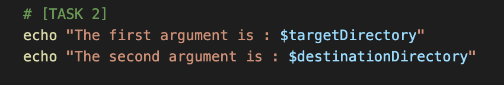
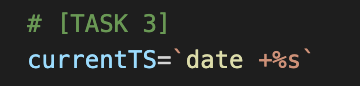
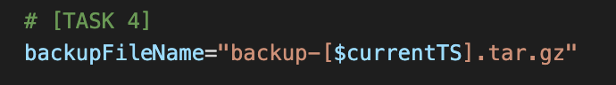
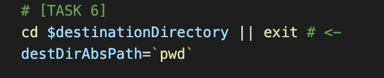
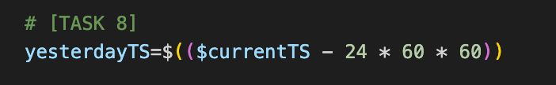
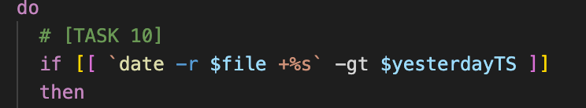
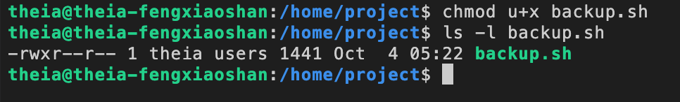
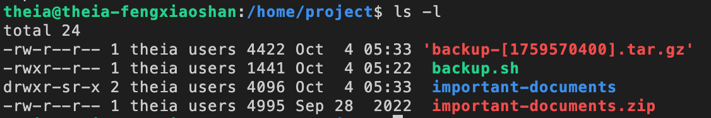

<a id="readme-top"></a>

<div align="center">
  <h1>Linux Commands and Shell Scripting</h1>  
     
</div>

## Project Scenario
In this scenario, you are a lead Linux developer at the top-tech company ABC International Inc. As one of ABC Inc.'s most trusted Linux developers, you have been tasked with creating a script called `backup.sh` which runs every day and automatically backs up any encrypted password files that have been updated in the past 24 hours.  

### Task 1
Set two variables equal to the values of the first and second command line arguments, as follows:  
1. Set `targetDirectory` to the first command line argument
2. Set `destinationDirectory` to the second command line argument
This task is meant to help with code readability.  

:ballot_box_with_check: ***Solution:***  
<kbd></kbd>

### Task 2 
Display the values of the two command line arguments in the terminal.

:ballot_box_with_check: ***Solution:***  
<kbd></kbd>

### Task 3 <a href="#readme-top">🔝</a>
Define a variable called `currentTS` as the current timestamp, expressed in seconds.

:ballot_box_with_check: ***Solution:***  
<kbd></kbd>

### Task 4 <a href="#readme-top">🔝</a>
Define a variable called `backupFileName` to store the name of the archived and compressed backup file that the script will create.  
> **NOTE**  
> The variable `backupFileName` should have the value `"backup-[$currentTS].tar.gz"`  
> For example, if `currentTS` has the value `1634571345`, then `backupFileName` should have the value `backup-1634571345.tar.gz`.

:ballot_box_with_check: ***Solution:***  
<kbd></kbd>

### Task 5 <a href="#readme-top">🔝</a>
Define a variable called `origAbsPath` with the absolute path of the current directory as the variable's value.

:ballot_box_with_check: ***Solution:***  
<kbd></kbd>

### Task 6 <a href="#readme-top">🔝</a>
Define a variable called `destAbsPath` whose value equals the absolute path of the destination directory.

> **NOTE**  
> Please Note that you can also use the cd “destinationDirectory” || exit which ensures that if the specified directory is incorrect or inaccessible, the script will terminate immediately at this step. This acts as an implicit validation check to confirm that the correct directory is provided before proceeding with further operations. Follow the same for Task 7 .

:ballot_box_with_check: ***Solution:***  
<kbd></kbd>

### Task 7 <a href="#readme-top">🔝</a>
Change directories from the current working directory to the target directory `targetDirectory`.

:ballot_box_with_check: ***Solution:***  
<kbd></kbd>

### Task 8 <a href="#readme-top">🔝</a>
You need to find files that have been updated within the past 24 hours. This means you need to find all files whose last-modified date was 24 hours ago or less.  
To do make this easier, define a numerical variable called `yesterdayTS` as the timestamp (in seconds) 24 hours prior to the current timestamp, `currentTS`.

:ballot_box_with_check: ***Solution:***  
<kbd></kbd>

### Task 9 <a href="#readme-top">🔝</a>
In the for loop, use the wildcard to iterate over all files and directories in the current folder.

:ballot_box_with_check: ***Solution:***  
<kbd></kbd>

### Task 10 <a href="#readme-top">🔝</a>
1. Inside the `for` loop, you want to check whether the `$file` was modified within the last 24 hours.

> **NOTE**
> To get the last-modified date of a file in seconds, use `date -r $file +%s` then compare the value to `yesterdayTS`.  
> `if [[ $file_last_modified_date -gt $yesterdayTS ]]` then the file was updated within the last 24 hours!

2. Since much of this wasn't covered in the course, for this task you may copy the code below and paste it into the double square brackets `[[]]`:
  ```sh
  `date -r $file +%s` -gt $yesterdayTS
  ```

:ballot_box_with_check: ***Solution:***  
<kbd></kbd>

### Task 11 <a href="#readme-top">🔝</a>
1. In the `if-then` statement, add the `$file` that was updated in the past 24-hours to the `toBackup` array.
2. Since much of this wasn’t covered in the course, you may copy the code below and place after the `then` statement for this task:
  ```bash
  toBackup+=($file)
  ```

:ballot_box_with_check: ***Solution:***  
<kbd></kbd>

### Task 12 <a href="#readme-top">🔝</a>
After the for loop, compress and archive the files, using the `$toBackup` array of filenames, to a file with the name `backupFileName`.

:ballot_box_with_check: ***Solution:***  
<kbd></kbd>

### Task 13 <a href="#readme-top">🔝</a>
Now the file `$backupFileName` is created in the current working directory.

:ballot_box_with_check: ***Solution:***  
<kbd></kbd>

### Task 14 <a href="#readme-top">🔝</a>
Save the current working file `backup.sh`.

### Task 15 <a href="#readme-top">🔝</a>
Make the `backup.sh` executable using `chmod` command.

:ballot_box_with_check: ***Solution:***  
<kbd></kbd>

### Task 16 <a href="#readme-top">🔝</a>
1. Download the following `.zip` file with the `wget` command:
  ```bash
  wget https://cf-courses-data.s3.us.cloud-object-storage.appdomain.cloud/IBM-LX0117EN-SkillsNetwork/labs/Final%20Project/important-documents.zip
  ```
2. Unzip the archive file:
  ```bash
  unzip -DDo important-documents.zip
  ```
3. Update the file’s last-modified date to now:
  ```bash
  touch important-documents/*
  ```
4. Test your script using the following command:
  ```bash
  ./backup.sh important-documents .
  ```

:ballot_box_with_check: ***Solution:***  
<kbd></kbd>

### Task 17 <a href="#readme-top">🔝</a>
1. Copy the `backup.sh` script into the `/usr/local/bin/` directory. (Do not use `mv`.)
2. Test the cronjob to see if the backup script is getting triggered by scheduling it for every 1 minute.
3. Using crontab, schedule your `/usr/local/bin/backup.sh` script to backup the `important-documents` folder every 24 hours to the directory `/home/project`.

:ballot_box_with_check: ***Solution:***  
<kbd></kbd>


