<div align="center">
  <h1>Build an ML Pipeline for Airfoil noise prediction</h1>  
  
  
  
</div>

## Project Scenario
You are a data engineer at an aeronautics consulting company. Your company prides itself in being able to efficiently design airfoils for use in planes and sports cars. Data scientists in your office need to work with different algorithms and data in different formats. While they are good at Machine Learning, they count on you to be able to do ETL jobs and build ML pipelines. In this project you will use the modified version of the NASA Airfoil Self Noise dataset. You will clean this dataset, by dropping the duplicate rows, and removing the rows with null values. You will create an ML pipe line to create a model that will predict the SoundLevel based on all the other columns. You will evaluate the model and towards the end you will persist the model.

## Objectives
In this 4 part assignment you will:  
- Part 1 Perform ETL activity
  - Load a csv dataset
  - Remove duplicates if any
  - Drop rows with null values if any
  - Make transformations
  - Store the cleaned data in parquet format
- Part 2 Create a Machine Learning Pipeline
  - Create a machine learning pipeline for prediction
- Part 3 Evaluate the Model
  - Evaluate the model using relevant metrics
- Part 4 Persist the Model
  - Save the model for future production use
  - Load and verify the stored model

## Datasets
In this lab you will be using dataset(s):
- The original dataset can be found here NASA airfoil self noise dataset. https://archive.ics.uci.edu/dataset/291/airfoil+self+noise
- This dataset is licensed under a Creative Commons Attribution 4.0 International (CC BY 4.0) license.

Diagram of an airfoil:  
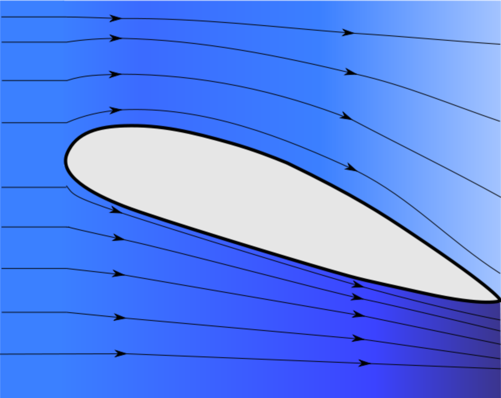

Diagram showing the Angle of attack:  
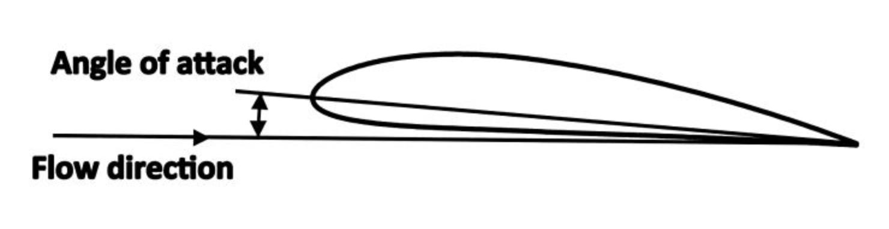

## Setup
For this lab, we will be using the following libraries:
- `PySpark` for connecting to the Spark Cluster

#### Installing Required Libraries¶
Spark Cluster is pre-installed in the Skills Network Labs environment. However, you need libraries like pyspark and findspark to connect to this cluster.
```sh
!pip install pyspark==3.1.2 -q
!pip install findspark -q
```
#### Importing Required Libraries
```py
# You can also use this section to suppress warnings generated by your code:
def warn(*args, **kwargs):
    pass
import warnings
warnings.warn = warn
warnings.filterwarnings('ignore')

# FindSpark simplifies the process of using Apache Spark with Python

import findspark
findspark.init()
```

## Part 1 - Perform ETL activity
### Task 1 - Import required libraries
:ballot_box_with_check: ***Solution:***  
```py
#your code goes here
from pyspark.sql import SparkSession
from pyspark.ml.feature import VectorAssembler
from pyspark.ml.feature import StandardScaler
from pyspark.ml.regression import LinearRegression
from pyspark.ml import Pipeline
from pyspark.ml.pipeline import PipelineModel
```

### Task 2 - Create a spark session
:ballot_box_with_check: ***Solution:***  
```py
#Create a SparkSession

spark = SparkSession.builder.appName('Final project').getOrCreate()
```

### Task 3 - Load the csv file into a dataframe
Download the data file.
```py
!wget https://cf-courses-data.s3.us.cloud-object-storage.appdomain.cloud/IBMSkillsNetwork-BD0231EN-Coursera/datasets/NASA_airfoil_noise_raw.csv
```

:ballot_box_with_check: ***Solution:***  
```py
# Load the dataset that you have downloaded in the previous task

df = spark.read.csv('NASA_airfoil_noise_raw.csv', header=True, inferSchema=True)
```

### Task 4 - Print top 5 rows of the dataset

:ballot_box_with_check: ***Solution:***  
```py
#your code goes here
df.show(5)
```
<kbd>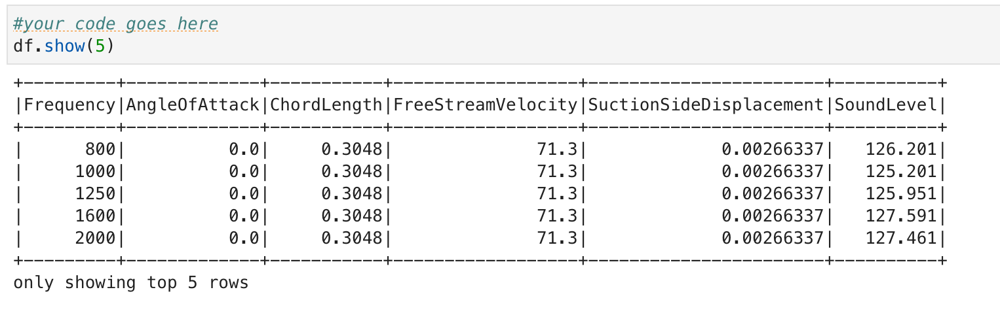</kbd>

### Task 5 - Print the total number of rows in the dataset

:ballot_box_with_check: ***Solution:***  
```py
#your code goes here
rowcount1 = df.count()
print(rowcount1)
```
<kbd></kbd>

### Task 6 - Drop all the duplicate rows from the dataset
:ballot_box_with_check: ***Solution:***  
```py
df = df.dropDuplicates()
```

### Task 7 - Print the total number of rows in the dataset
:ballot_box_with_check: ***Solution:***  
```py
#your code goes here

rowcount2 = df.count()
print(rowcount2)
```
<kbd>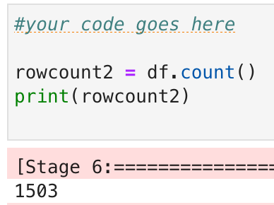</kbd>

### Task 8 - Drop all the rows that contain null values from the dataset
:ballot_box_with_check: ***Solution:***  
```py
df = df.dropna()
```

### Task 9 - Print the total number of rows in the dataset
:ballot_box_with_check: ***Solution:***  
```py
#your code goes here

rowcount3 = df.count()
print(rowcount3)
```
<kbd>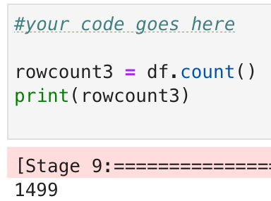</kbd>

### Task 10 - Rename the column "SoundLevel" to "SoundLevelDecibels"
:ballot_box_with_check: ***Solution:***  
```py
# your code goes here

df = df.withColumnRenamed('SoundLevel', 'SoundLevelDecibels')
```

### Task 11 - Save the dataframe in parquet format, name the file as "NASA_airfoil_noise_cleaned.parquet"
:ballot_box_with_check: ***Solution:***  
```py
# your code goes here

df.write.mode('overwrite').parquet('NASA_airfoil_noise_cleaned.parquet')
```

#### Part 1 - Evaluation
```py
print("Part 1 - Evaluation")

print("Total rows = ", rowcount1)
print("Total rows after dropping duplicate rows = ", rowcount2)
print("Total rows after dropping duplicate rows and rows with null values = ", rowcount3)
print("New column name = ", df.columns[-1])

import os

print("NASA_airfoil_noise_cleaned.parquet exists :", os.path.isdir("NASA_airfoil_noise_cleaned.parquet"))
```
<kbd>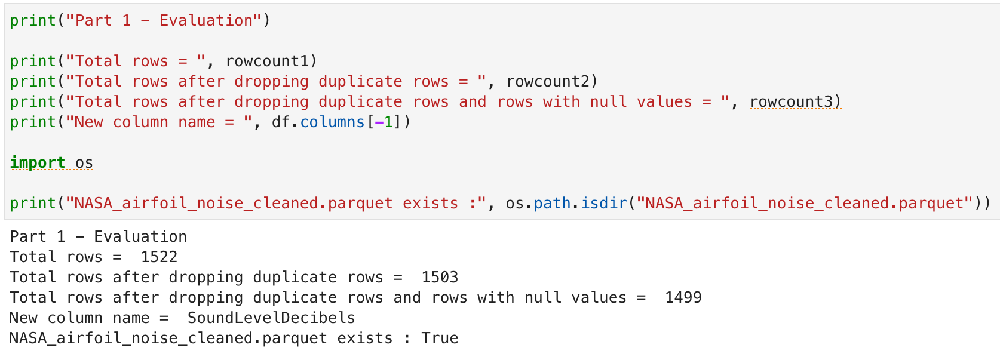</kbd>

## Part - 2 Create a Machine Learning Pipeline
### Task 1 - Load data from "NASA_airfoil_noise_cleaned.parquet" into a dataframe
:ballot_box_with_check: ***Solution:***  
```py
#your code goes here

df = spark.read.parquet('NASA_airfoil_noise_cleaned.parquet')
```

### Task 2 - Print the total number of rows in the dataset
:ballot_box_with_check: ***Solution:***  
```py
#your code goes here

rowcount4 = df.count()
print(rowcount4)
```
<kbd>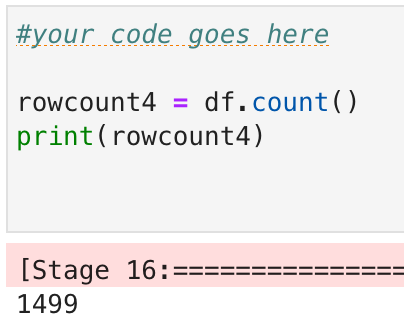</kbd>

### Task 3 - Define the VectorAssembler pipeline stage
Stage 1 - Assemble the input columns into a single column "features". Use all the columns except SoundLevelDecibels as input features.

:ballot_box_with_check: ***Solution:***  
```py
#your code goes here

assembler = VectorAssembler(inputCols=['Frequency','AngleOfAttack','ChordLength','FreeStreamVelocity','SuctionSideDisplacement'],\
                            outputCol='features')
```

### Task 4 - Define the StandardScaler pipeline stage
Stage 2 - Scale the "features" using standard scaler and store in "scaledFeatures" column.

:ballot_box_with_check: ***Solution:***  
```py
#your code goes here

scaler = StandardScaler(inputCol='features', outputCol='scaledFeatures')
```

### Task 5 - Define the Model creation pipeline stage
Stage 3 - Create a LinearRegression stage to predict "SoundLevelDecibels".

> **NOTE:** You need to use the scaledfeatures retreived in the previous step(StandardScaler pipeline stage).

:ballot_box_with_check: ***Solution:***  
```py
#your code goes here

lr = LinearRegression(featuresCol='scaledFeatures', labelCol='SoundLevelDecibels')
```

### Task 6 - Build the pipeline
Build a pipeline using the above three stages.

:ballot_box_with_check: ***Solution:***  
```py
#your code goes here

pipeline = Pipeline(stages=[assembler, scaler, lr])
```

### Task 7 - Split the data
:ballot_box_with_check: ***Solution:***  
```py
# Split the data into training and testing sets with 70:30 split.
# set the value of seed to 42
# the above step is very important. DO NOT set the value of seed to any other value other than 42.

#your code goes here

(trainingData, testingData) = df.randomSplit([0.7, 0.3], seed=42)
```

### Task 8 - Fit the pipeline
:ballot_box_with_check: ***Solution:***  
```py
# Fit the pipeline using the training data
# your code goes here

pipelineModel = pipeline.fit(trainingData)
```

#### Part 2 - Evaluation
```py
print("Part 2 - Evaluation")
print("Total rows = ", rowcount4)
ps = [str(x).split("_")[0] for x in pipeline.getStages()]

print("Pipeline Stage 1 = ", ps[0])
print("Pipeline Stage 2 = ", ps[1])
print("Pipeline Stage 3 = ", ps[2])

print("Label column = ", lr.getLabelCol())
```
<kbd>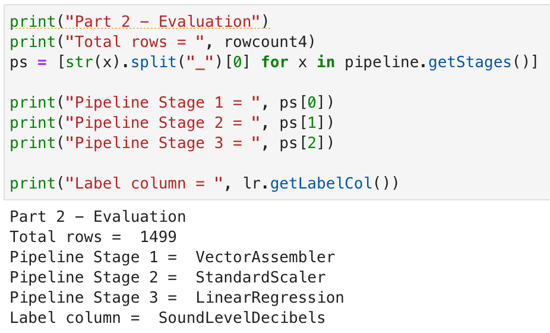</kbd>

## Part 3 - Evaluate the Model
### Task 1 - Predict using the model
:ballot_box_with_check: ***Solution:***  
```py
# Make predictions on testing data
# your code goes here

predictions = pipelineModel.transform(testingData)
```

### Task 2 - Print the MSE
:ballot_box_with_check: ***Solution:***  
```py
#your code goes here

from pyspark.ml.evaluation import RegressionEvaluator
evaluator = RegressionEvaluator(predictionCol='prediction', labelCol = 'SoundLevelDecibels', metricName='mse')
mse = evaluator.evaluate(predictions)
print(mse)
```
<kbd>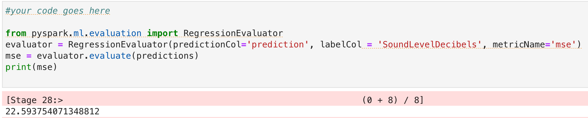</kbd>

### Task 3 - Print the MAE
:ballot_box_with_check: ***Solution:***  
```py
#your code goes here

evaluator = RegressionEvaluator(predictionCol='prediction', labelCol='SoundLevelDecibels', metricName='mae')
mae = evaluator.evaluate(predictions)
print(mae)
```
<kbd>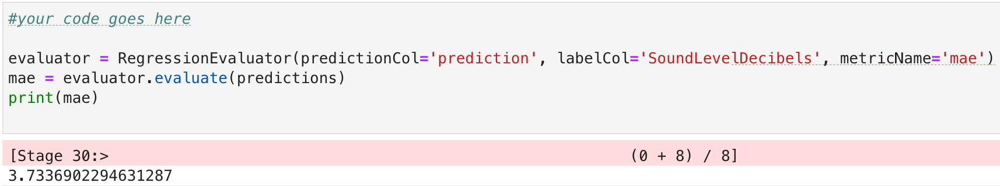</kbd>

### Task 4 - Print the R-Squared(R2)
:ballot_box_with_check: ***Solution:***  
```py
#your code goes here

evaluator = RegressionEvaluator(predictionCol='prediction', labelCol='SoundLevelDecibels', metricName='r2')
r2 = evaluator.evaluate(predictions)
print(r2)
```
<kbd>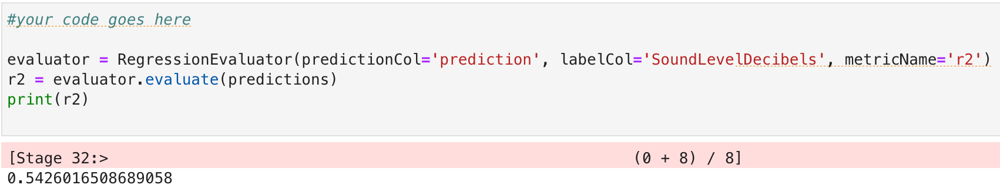</kbd>

#### Part 3 - Evaluation
```py
print("Part 3 - Evaluation")

print("Mean Squared Error = ", round(mse,2))
print("Mean Absolute Error = ", round(mae,2))
print("R Squared = ", round(r2,2))

lrModel = pipelineModel.stages[-1]

print("Intercept = ", round(lrModel.intercept,2))
```
<kbd>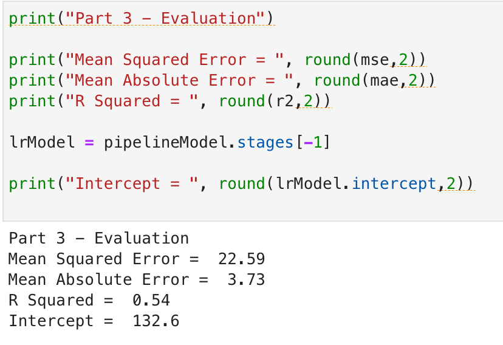</kbd>

## Part 4 - Persist the Model
### Task 1 - Save the model to the path "Final_Project"
:ballot_box_with_check: ***Solution:***  
```py
# Save the pipeline model as "Final_Project"
# your code goes here
pipelineModel.write().save('Final_Project')
```

### Task 2 - Load the model from the path "Final_Project"
:ballot_box_with_check: ***Solution:***  
```py
# Load the pipeline model you have created in the previous step
loadedPipelineModel = PipelineModel.load('Final_Project')
```

### Task 3 - Make predictions using the loaded model on the testdata
:ballot_box_with_check: ***Solution:***  
```py
# Use the loaded pipeline model and make predictions using testingData
predictions = loadedPipelineModel.transform(testingData)
```

### Task 4 - Show the predictions
:ballot_box_with_check: ***Solution:***  
```py
#show top 5 rows from the predections dataframe. Display only the label column and predictions
#your code goes here
predictions.show(5)
```
<kbd></kbd>

#### Part 4 - Evaluation
```py
print("Part 4 - Evaluation")

loadedmodel = loadedPipelineModel.stages[-1]
totalstages = len(loadedPipelineModel.stages)
inputcolumns = loadedPipelineModel.stages[0].getInputCols()

print("Number of stages in the pipeline = ", totalstages)
for i,j in zip(inputcolumns, loadedmodel.coefficients):
    print(f"Coefficient for {i} is {round(j,4)}")
```
<kbd>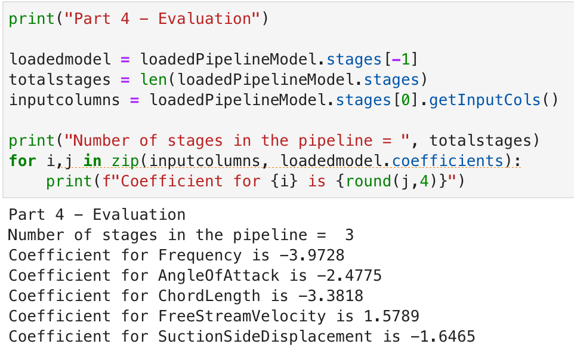</kbd>
