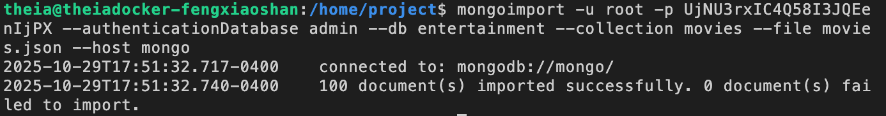
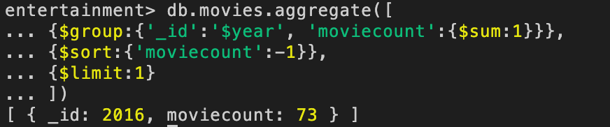
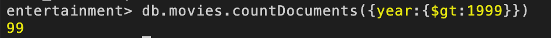
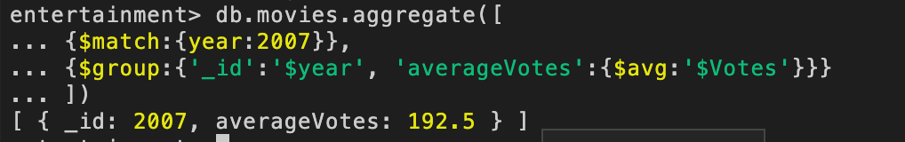
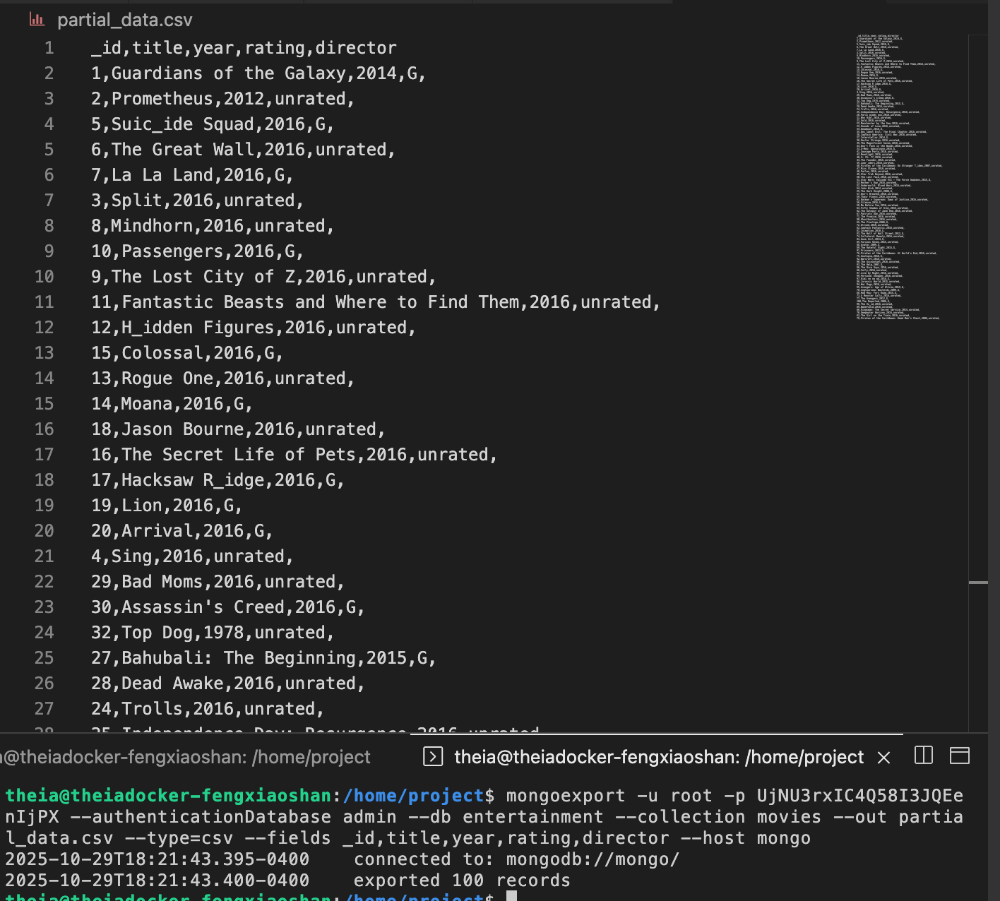
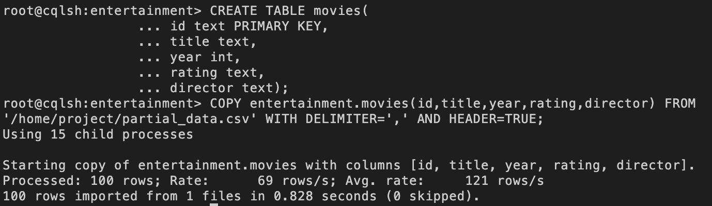
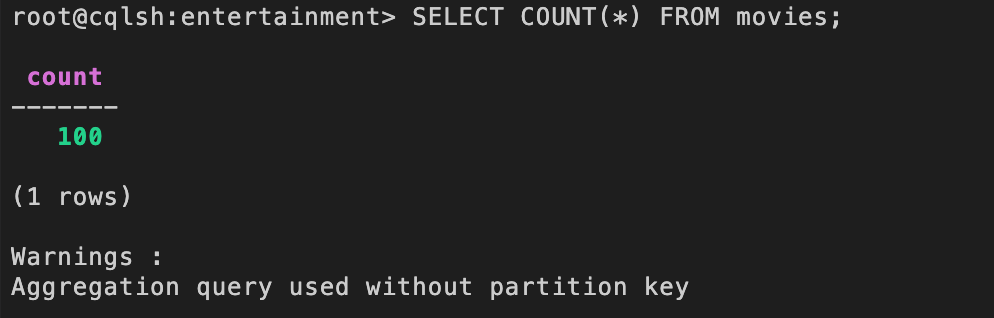
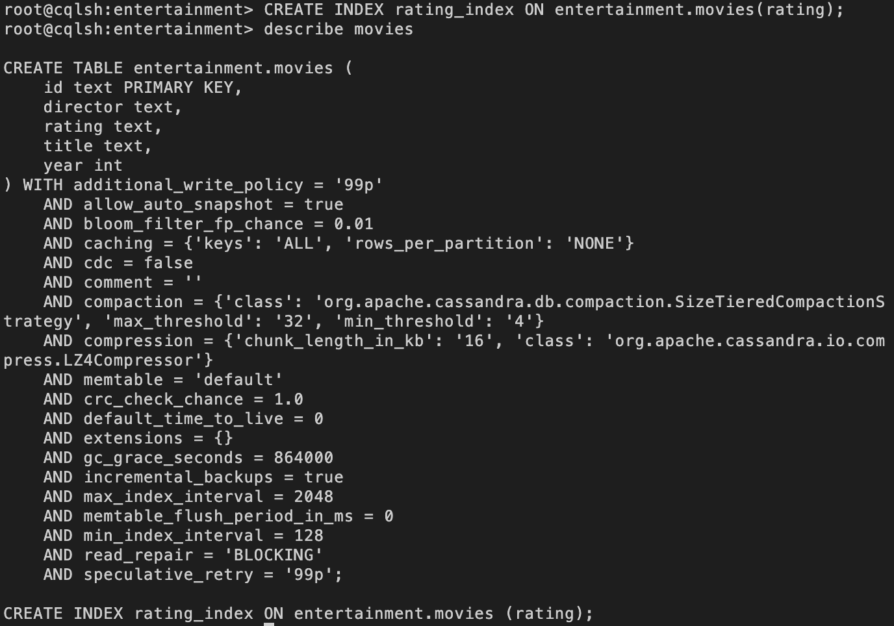
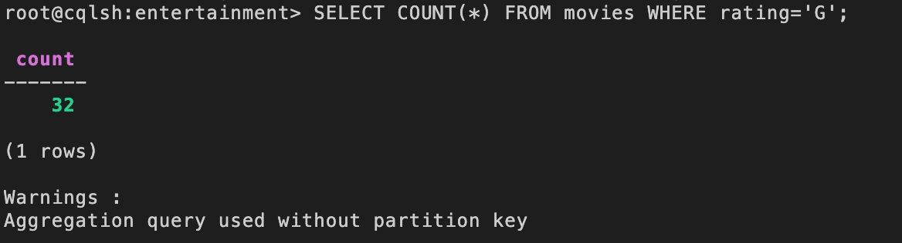

<div align="center">
  <h1>Data Engineering for a Consulting Firm</h1>  
  
  
</div>

## Project Scenario
You are a data engineer at a data analytics consulting company. Your company prides itself in being able to efficiently handle data in any format on any database on any platform. Analysts in your office need to work with data on different databases, and data in different formats. While these analysts are good at analyzing data, they count on you to be able to move data from external sources into various databases, to be able to move data from one type of database to another, and be able to run basic queries on various databases.

## Exercise 1: Working with a MongoDB database
#### Download sample data file
Use the following command to download the data file in your Cloud IDE project directory.  
```bash
curl -O https://cf-courses-data.s3.us.cloud-object-storage.appdomain.cloud/IBMSkillsNetwork-DB0151EN-edX/labs/FinalProject/movies.json
```

#### A sample movie document
```js
{
  _id: '9',
  title: 'The Lost City of Z',
  genre: 'Action,Adventure,Biography',
  Description: 'A true-life drama, centering on British explorer Col. Percival Fawcett, who disappeared while searching for a mysterious city in the Amazon in the 1920s.',
  Director: 'James Gray',
  Actors: 'Charlie Hunnam, Robert Pattinson, Sienna Miller, Tom Holland',
  year: 2016,
  'Runtime (Minutes)': 141,
  rating: 'unrated',
  Votes: 7188,
  'Revenue (Millions)': 8.01,
  Metascore: 78
}
```

### Task 1: Import `movies.json` into mongodb server into a database named `entertainment` and a collection named `movies`

:ballot_box_with_check: ***Solution:***  
<kbd></kbd>

### Task 2: Write a mongodb query to find the year in which most number of movies were released

:ballot_box_with_check: ***Solution:***  
<kbd></kbd>

### Task 3: Write a mongodb query to find the count of movies released after the year 1999

:ballot_box_with_check: ***Solution:***  
<kbd></kbd>

### Task 4: Write a query to find out the average votes for movies released in 2007

:ballot_box_with_check: ***Solution:***  
<kbd></kbd>

### Task 5: Export the fields `_id`, `title`, `year`, `rating` and `director` from the `movies` collection into a file named `partial_data.csv`

:ballot_box_with_check: ***Solution:***  
<kbd></kbd>

## Exercise 2 - Working with a Cassandra database
#### Download sample data file
If you haven't managed to successfully export data into partial_data.csv file, then download the data file lready created for you with the following command.    
```bash
curl -O https://cf-courses-data.s3.us.cloud-object-storage.appdomain.cloud/IBMSkillsNetwork-DB0151EN-edX/labs/FinalProject/partial_data.csv
```

### Task 6 - Create a keyspace named `entertainment`
Use the `CREATE KEYSPACE` command. Once created, use the `describe` command and use the output for assessment. 

:ballot_box_with_check: ***Solution:***  
<kbd></kbd>

### Task 7 - Import `partial_data.csv` into cassandra server into a keyspace named `entertainment` and a table named `movies`
While creating the table `movies` configure all of the columns as text columns including the id column.  
- _id
- title
- year
- rating
- director

And now import the data present in `partial_data.csv`.

:ballot_box_with_check: ***Solution:***  
<kbd></kbd>

### Task 8 - Write a cql query to count the number of rows in the `movies` table

:ballot_box_with_check: ***Solution:***  
<kbd></kbd>

### Task 9 - Create an index for the `rating` column in the `movies` table using cql
And then run the `describe` on `movies` that shows `CREATE INDEX` listed in the output. 

:ballot_box_with_check: ***Solution:***  
<kbd></kbd>

### Task 10 - Write a cql query to count the number of movies that are rated 'G'.

:ballot_box_with_check: ***Solution:***  
<kbd></kbd>


