

  <h1>PostgreSQL Data Warehouse Project</h1>  
  

## Project Scenario
You are a data engineer hired by a solid waste management company. The company collects and recycles solid waste across major cities in the country of Brazil. The company operates hundreds of trucks of different types to collect and transport solid waste. The company would like to create a data warehouse so that it can create reports according to their requirements.

## Exercise 1: Design a data warehouse
The solid waste management company has provided you the sample data they want to collect.  

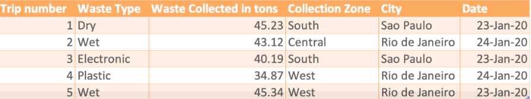  

You will start your project by designing a Star Schema warehouse by identifying the columns for the various dimensions and fact tables in the schema.

### Task 1: Design the dimension table MyDimDate
Write down the fields in the MyDimDate table in any text editor, one field per line. The company is looking at a granularity of day, which means they would like to have the ability to generate the report on a yearly, monthly, daily, and weekday basis.

:ballot_box_with_check: ***Solution:***  
<kbd>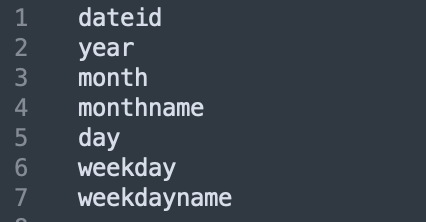</kbd>

### Task 2: Design the dimension table MyDimWaste
Write down the fields in the MyDimWaste table in any text editor, one field per line.

:ballot_box_with_check: ***Solution:***  
<kbd>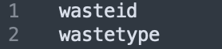</kbd>

### Task 3: Design the dimension table MyDimZone
Write down the fields in the MyDimZone table in any text editor, one field per line. 

:ballot_box_with_check: ***Solution:***  
<kbd>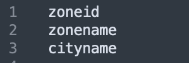</kbd>

### Task 4: Design the fact table MyFactTrips
Write down the fields in the MyFactTrips table in any text editor, one field per line. 

:ballot_box_with_check: ***Solution:***  
<kbd>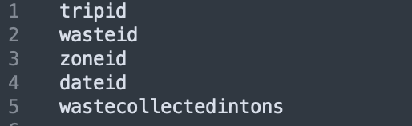</kbd>

## Exercise 2 - Create schema for data warehouse on PostgreSQL
In this exercise, you will create the tables you have designed in the previous exercise. Open pgAdmin and create a database named Project, then create the following tables.
### Task 5: Create the dimension table MyDimDate

:ballot_box_with_check: ***Solution:***  
<kbd>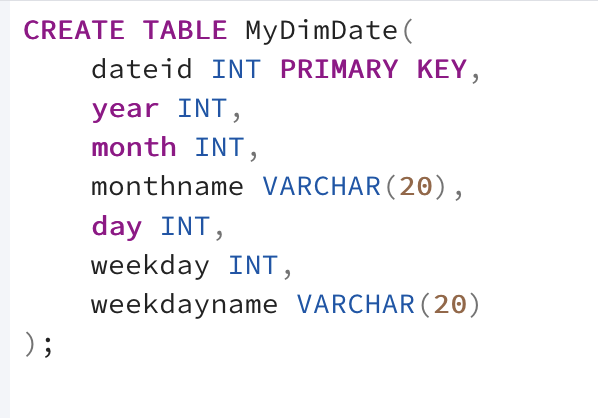</kbd>

### Task 6: Create the dimension table MyDimWaste

:ballot_box_with_check: ***Solution:***  
<kbd>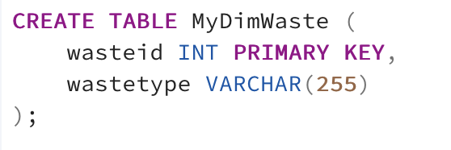</kbd>

### Task 7: Create the dimension table MyDimZone

:ballot_box_with_check: ***Solution:***  
<kbd>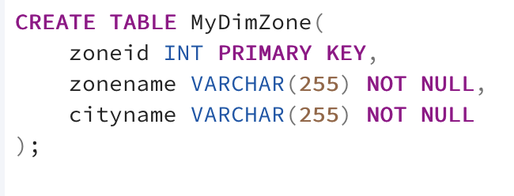</kbd>

### Task 8: Create the fact table MyFactTrips

:ballot_box_with_check: ***Solution:***  
<kbd>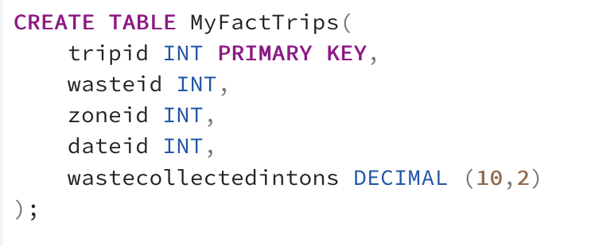</kbd>

## Exercise 3: Load data into the data warehouse
In this exercise, you will load the data into the tables.
### Task 9: Load data into the dimension table DimDate
Take a screenshot of the first 5 rows in the table DimDate.

:ballot_box_with_check: ***Solution:***  
<kbd>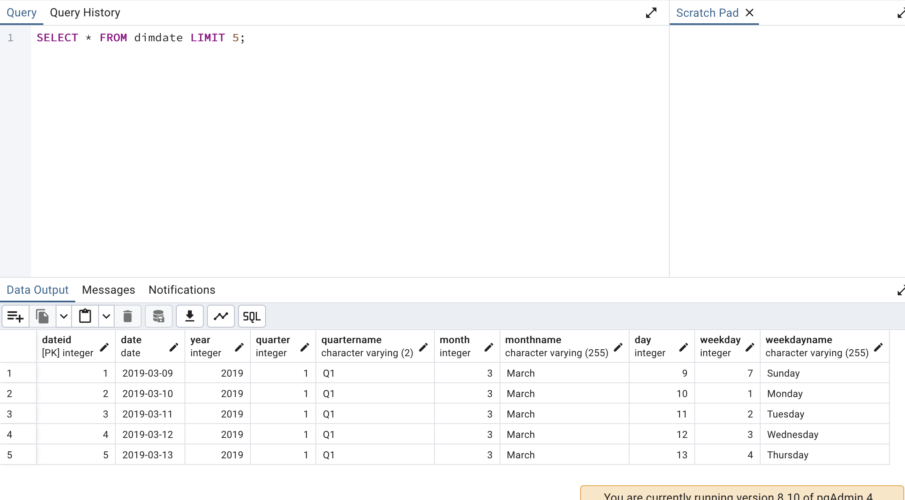</kbd>

### Task 10: Load data into the dimension table DimTruck
Take a screenshot of the first 5 rows in the table DimTruck. 

:ballot_box_with_check: ***Solution:***  
<kbd>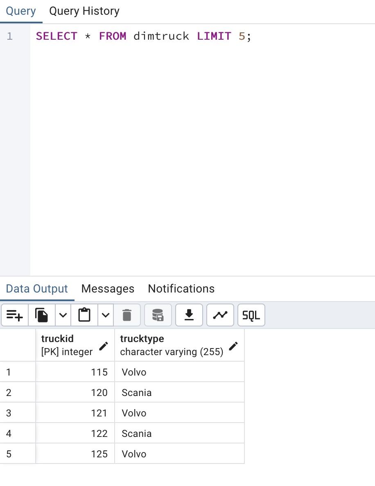</kbd>

### Task 11: Load data into the dimension table DimStation
Take a screenshot of the first 5 rows in the table DimStation. 

:ballot_box_with_check: ***Solution:***  
<kbd>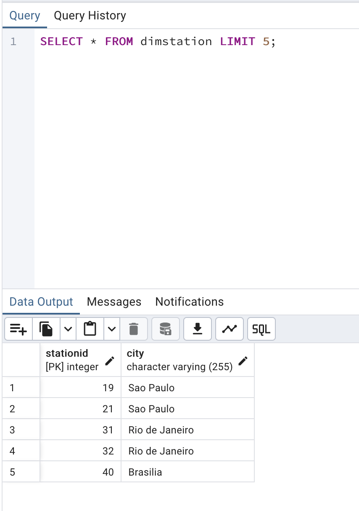</kbd>

### Task 12: Load data into the fact table FactTrips
Take a screenshot of the first 5 rows in the table FactTrips. 

:ballot_box_with_check: ***Solution:***  
<kbd>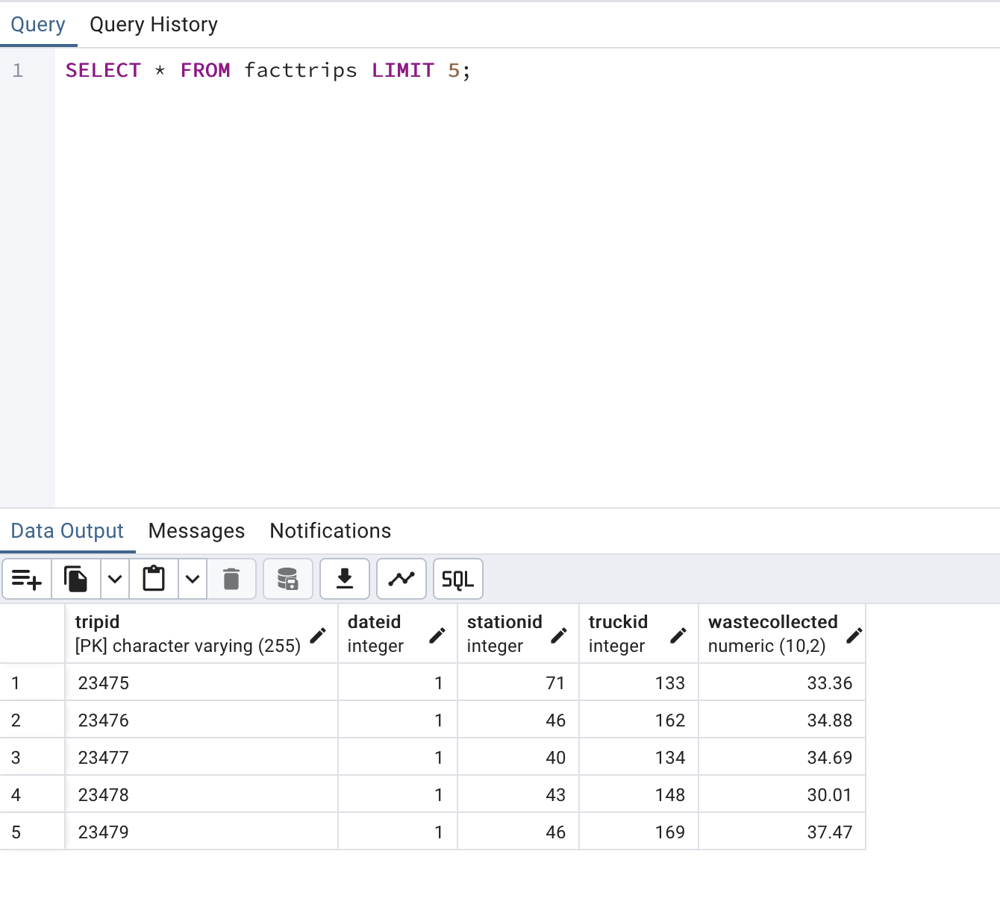</kbd>

## Exercise 4 - Write aggregation queries and create materialized views
In this exercise, you will query the data you have loaded in the previous exercise. 
### Task 13: Create a grouping sets query
Create a grouping sets query using the columns stationid, trucktype, total waste collected. 

:ballot_box_with_check: ***Solution:***  
<kbd>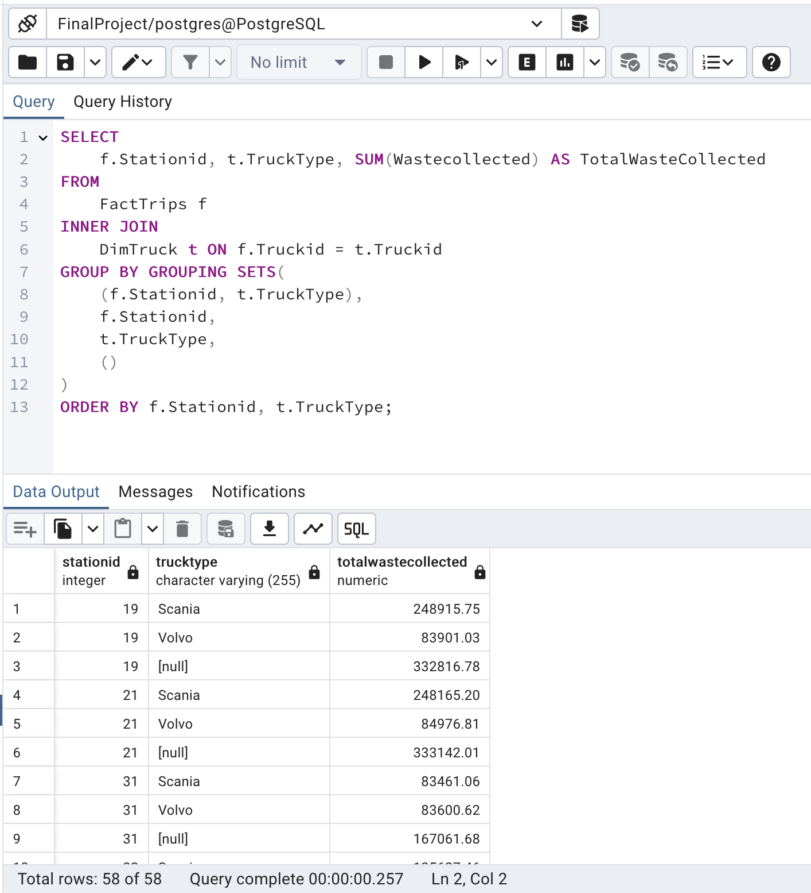</kbd>

### Task 14: Create a rollup query
Create a rollup query using the columns year, city, stationid, and total waste collected. 

:ballot_box_with_check: ***Solution:***  
<kbd>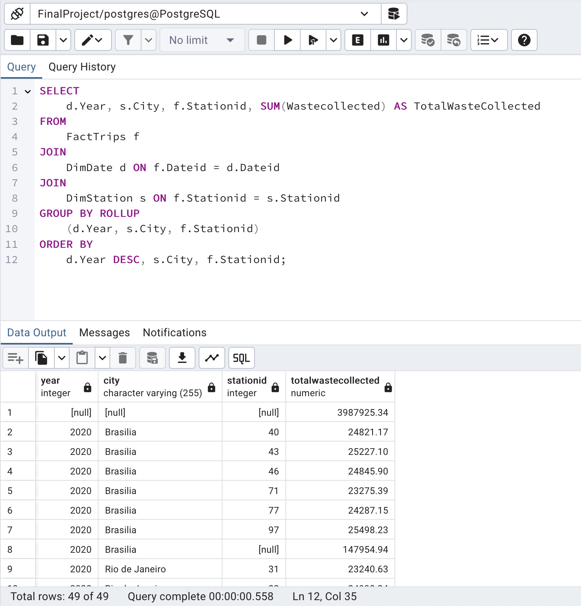</kbd>

### Task 15: Create a cube query
Create a cube query using the columns year, city, stationid, and average waste collected. 

:ballot_box_with_check: ***Solution:***  
<kbd>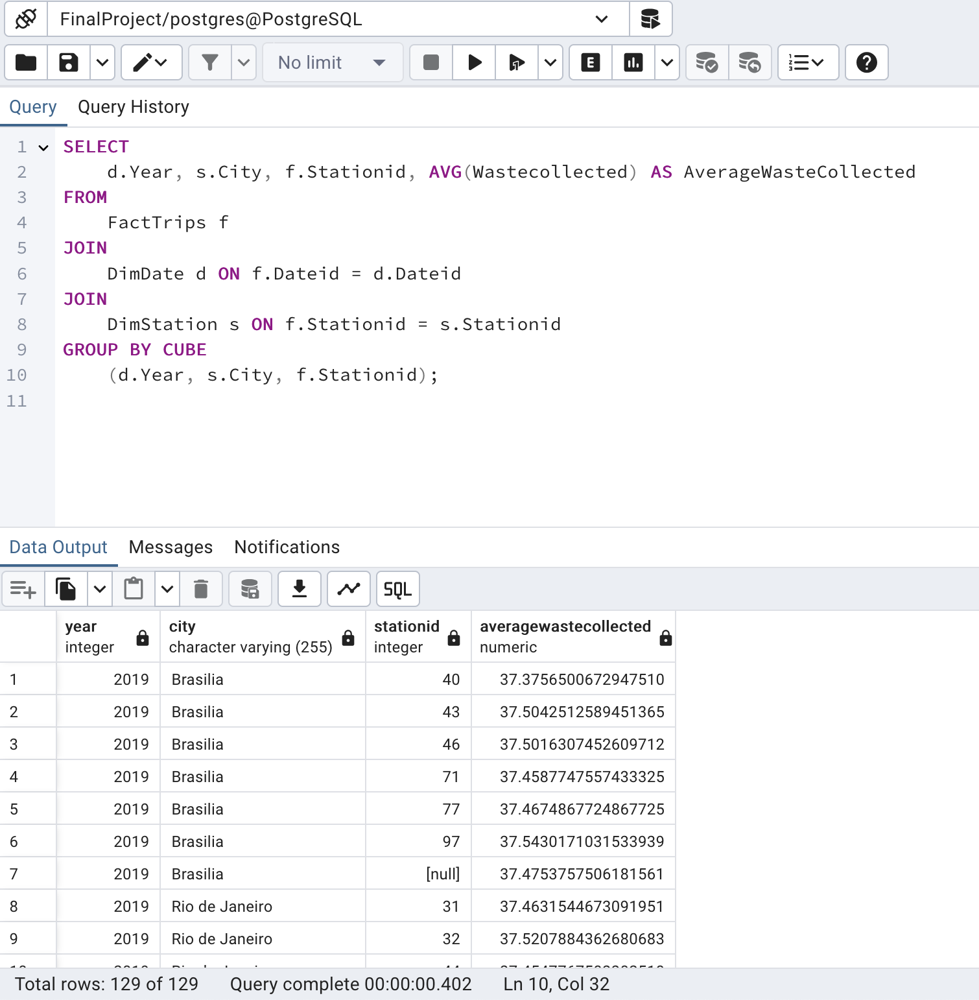</kbd>

### Task 16: Create a materialized view
Create a materialized view named max_waste_stats using the columns city, stationid, trucktype, and max waste collected. 

:ballot_box_with_check: ***Solution:***  
<kbd>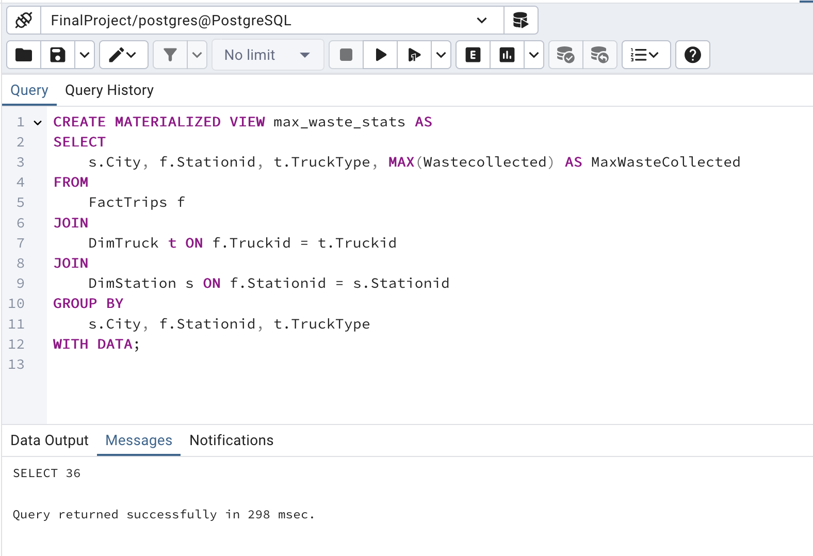</kbd>

