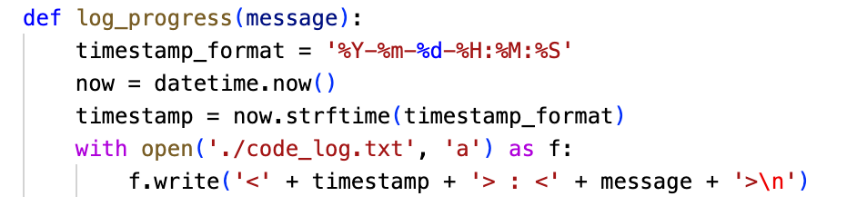
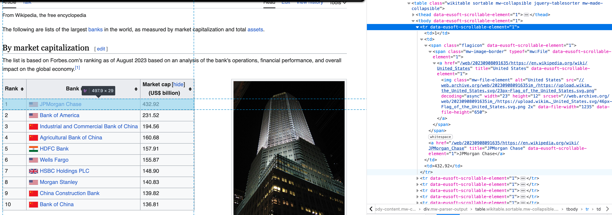
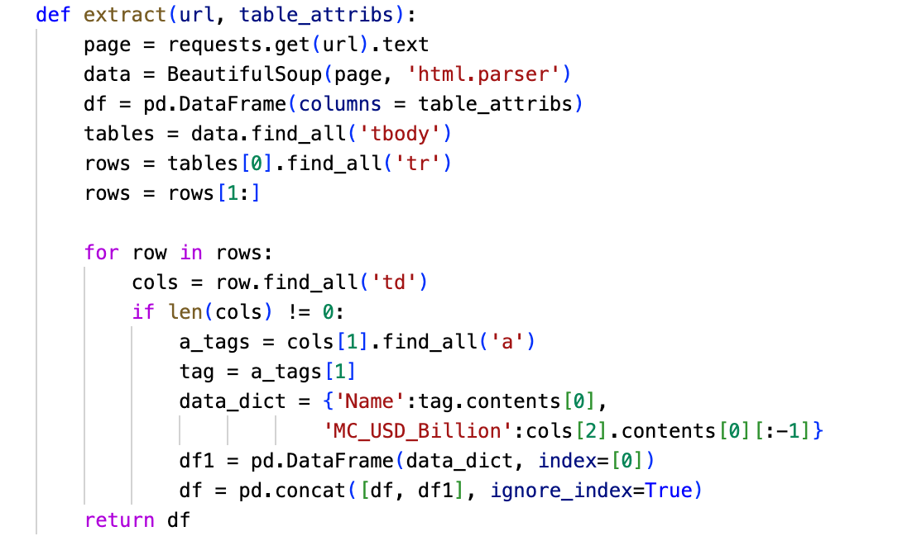
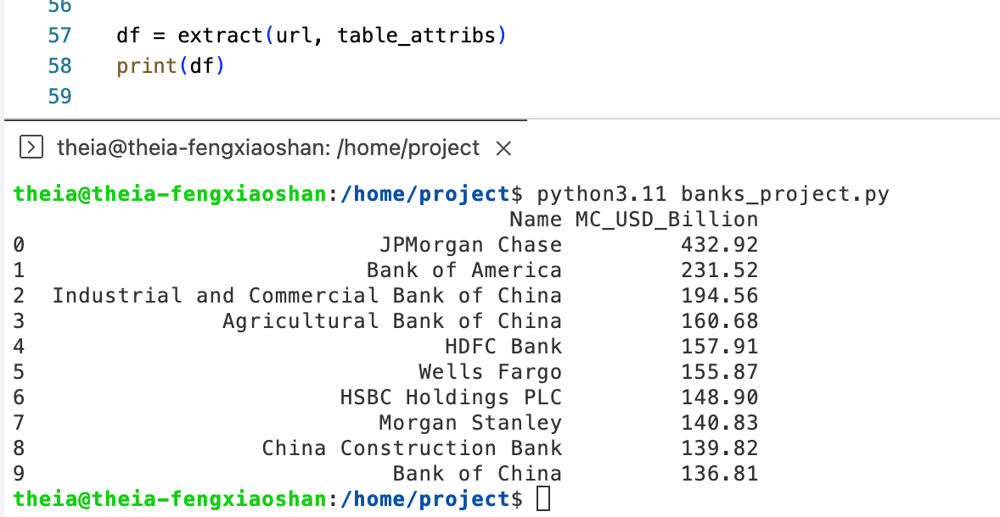
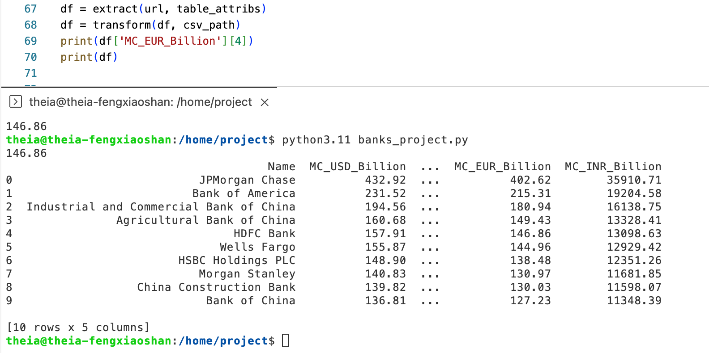
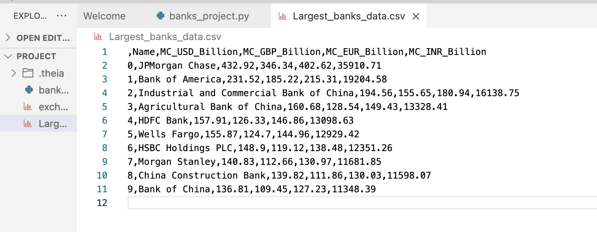
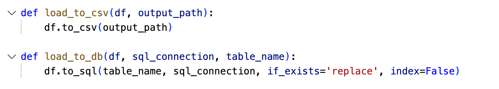
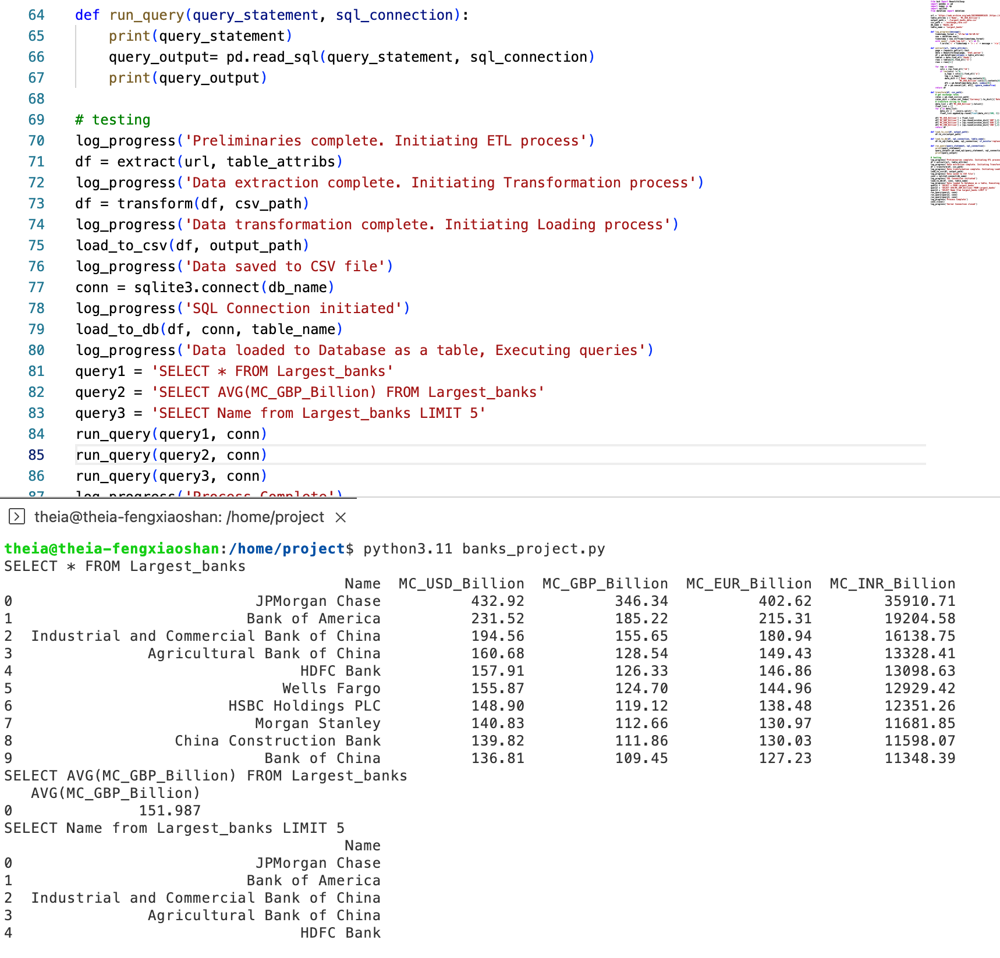
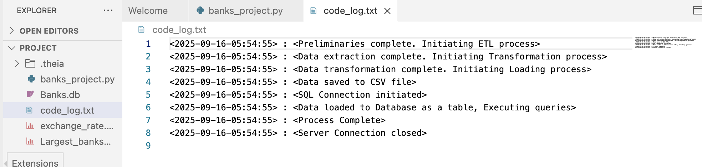

# Acquiring and Processing Information on the World's Largest Banks

<p align="center">
  
  
</p>

## Project Scenario:
You have been hired as a data engineer by research organization. 
Your boss has asked you to create a code that can be used to compile the list of the top 10 largest banks in the world ranked by market capitalization in billion USD. 
Further, the data needs to be transformed and stored in GBP, EUR and INR as well, in accordance with the exchange rate information that has been made available to you as a CSV file. 
The processed information table is to be saved locally in a CSV format and as a database table.  

Your job is to create an automated system to generate this information so that the same can be executed in every financial quarter to prepare the report.

### Task 1: Logging function
Write a function `log_progress()` to log the progress of the code at different stages in a file `code_log.txt`. Use the list of log points provided to create log entries as every stage of the code.  

The format to be used for logging must have the syntax:  
```
<time_stamp> : <message>
```
Each log entry must happen in the next line in the text file.  
You must associate the correct log entries with each of the executed function calls. Use the following table to note the logging message at the end of each function call that follows.  
| Task | Log message on completion |
| --- | --- |
| Declaring known values | Preliminaries complete. Initiating ETL process |
| Call extract() function | Data extraction complete. Initiating Transformation process |
| Call transform() function | Data transformation complete. Initiating Loading process |
| Call load_to_csv() | Data saved to CSV file |
| Initiate SQLite3 connection | SQL Connection initiated |
| Call load_to_db() | Data loaded to Database as a table, Executing queries |
| Call run_query() | Process Complete |
| Close SQLite3 connection | Server Connection closed |

At this stage, you should now make the first log entry from the table above.  
:ballot_box_with_check: ***Solution:***  
<kbd></kbd>

### Task 2: Extraction of data
Extract the tabular information from the given URL under the heading 'By market capitalization' and save it to a dataframe.
```
https://web.archive.org/web/20230908091635/https://en.wikipedia.org/wiki/List_of_largest_banks
```
1. Inspect the webpage and identify the position and pattern of the tabular information in the HTML code
2. Write the code for a function `extract()` to perform the required data extraction.
3. Execute a function call to `extract()` to verify the output.  
> **Note**  
> Remember to remove the last character from the `Market Cap` column contents, like, '\n', and typecast the value to float format.  
> Rename the column `Market cap (US$ billion)` to `MC_USD_Billion`.  
> Make the relevant log entry.  

:ballot_box_with_check: ***Solution:***  
#### Q1:
Take a screenshot of the html code of the table, as obtained by inspecting the webpage. Make sure that the contents of at least the first row of the table, as entered in the HTML code, are completely visible.  
<kbd></kbd>

#### Q2:
Take a screenshot of the code, as created for the `extract()` function.  
<kbd></kbd>

#### Q3: 
Take a screenshot of the output, as obtained upon execution in the terminal.  
<kbd></kbd>

### Task 3: Transformation of data
Transform the dataframe by adding columns for Market Capitalization in GBP, EUR and INR, rounded to 2 decimal places, based on the exchange rate information shared as a CSV file.
a. Write the code for a function `transform()` to perform the said task.
b. Execute a function call to `transform()` and verify the output.  
A sample statement is being provided for adding the `MC_GBP_Billion` column. You can use this to add the other two statements on your own.  
```
df['MC_GBP_Billion'] = [np.round(x*exchange_rate['GBP'],2) for x in df['MC_USD_Billion']]
```
:ballot_box_with_check: ***Solution:***  
#### Q1: 
Take a screenshot of the code, as created for the `transform()` function.
<kbd></kbd>

#### Q2:
Take a snapshot of the output.  
<kbd></kbd>

### Task 4: Loading to CSV
Load the transformed dataframe to an output CSV file. Write a function `load_to_csv()`, execute a function call and verify the output.  
:ballot_box_with_check: ***Solution:***  
<kbd></kbd>

### Task 5: Loading to Database
Load the transformed dataframe to an SQL database server as a table. Write a function `load_to_db()`, execute a function call and verify the output.  
:ballot_box_with_check: ***Solution:***  
<kbd></kbd>

### Task 6: Function to Run queries on Database
Run queries on the database table. Write a function `run_queries()`, execute a given set of queries and verify the output.  
Execute 3 function calls using the queries as mentioned below.  
1. Print the contents of the entire table.
   ```
   SELECT * FROM Largest_banks
   ```
2. Print the average market capitalization of all the banks in Billion GBP.
   ```
   SELECT AVG(MC_GBP_Billion) FROM Largest_banks
   ```
3. Print only the names of the top 5 banks.
   ```
   SELECT Name from Largest_banks LIMIT 5
   ```
:ballot_box_with_check: ***Solution:***  
<kbd></kbd>

### Task 7: Verify log entries
Verify that the log entries have been completed at all stages by checking the contents of the file `code_log.txt`.  
:ballot_box_with_check: ***Solution:***  
<kbd></kbd>
