<a id="readme-top"></a>

<div align="center">
  <h1>Database Design and Implementation</h1>  
     
</div>

## Project Scenario
In this scenario, you have recently been hired as a Data Engineer by a New York-based coffee shop chain looking to expand nationally by opening several franchise locations. They want to streamline operations and revamp their data infrastructure as part of their expansion process.  
Your job is to design their relational database systems for improved operational efficiencies and make it easier for their executives to make data-driven decisions.  
Currently, their data resides in several systems: accounting software, supplier databases, point of sales (POS) systems, and even spreadsheets. You will review the data in all of these systems and design a central database to house all of the data. You will then create the database objects and load them with source data. Finally, you will create subsets of data your business partners require, export them, and load them into staging databases using several RDBMS.  

### Task 1: Identify entities 
The first step when designing a new database is to review any existing data and identify the entities for your new system.

1. The following image shows sample data from each source you will be working with to design your new central database. Review the image and identify the entities you plan to create.
   
2. Make a list of the entities you have identified.  

:ballot_box_with_check: ***Solution:***  
<kbd>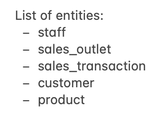</kbd>

### Task 2: Identify attributes <a href="#readme-top">🔝</a>
In this task, you will identify the attributes of one of the entities you plan to create.  
1. Using the information from the sample data in the image from Task 1, identify the entity's attributes that will store the sales transaction data.
2. Make a list of the sales transaction attributes that you identified.  

:ballot_box_with_check: ***Solution:***  
<kbd>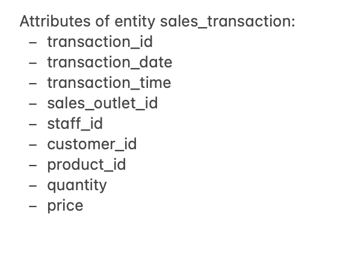</kbd>

### Task 3: Create an ERD <a href="#readme-top">🔝</a>
Now that you have defined some of your attributes and entities, you can determine the tables and columns for them and create an entity-relationship diagram (ERD). Use pgAdmin to complete this task:  
1. Create a new database named `COFFEE`, view the schemas in the new `COFFEE` database, and then start a new ERD project.
2. Add a table to the ERD for the sale transactions entity using the information in the following table. Consider the naming convention to use so that your colleagues can understand your data and ensure that the names are valid in other RDBMS. Use the sample data shown in the image in Task 1 to determine appropriate data types for each column.  
     

:ballot_box_with_check: ***Solution:***  
<kbd>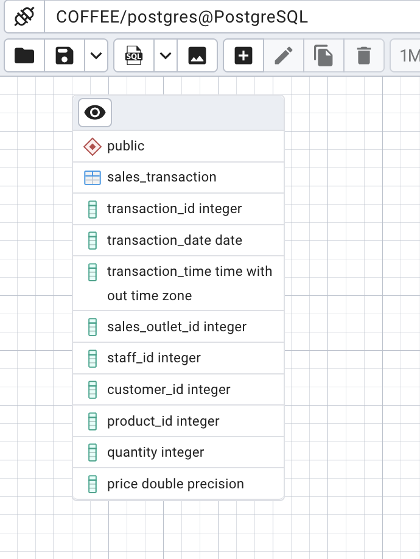</kbd>

3. Add a table to the ERD for the product entity using the information in the following table.  
     

:ballot_box_with_check: ***Solution:***  
<kbd>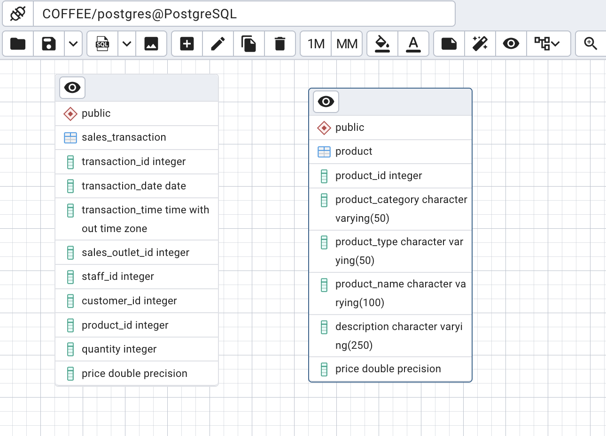</kbd>

### Task 4: Normalize tables <a href="#readme-top">🔝</a>
When reviewing your ERD, you notice it does not conform to the second normal form. In this task, you will normalize some of the tables within the database.  
1. Review the data in the sales transaction table. Note that the transaction id column does not contain unique values because some transactions include multiple products.
2. Determine which columns should be stored in a separate table to remove the repeating rows and to put this table into second normal form.
3. Add a new table named `sales_detail` to the ERD, define the columns in the new table, and delete the moved columns from the sales transaction table, leaving a matching column in each of the two tables to create a relationship between them later.  

:ballot_box_with_check: ***Solution:***  
<kbd></kbd>

4. Review the data in the product table. Note that the product category and product type columns contain redundant data.
5. Determine which columns should be stored in a separate table to reduce redundant data and to put this table into a second normal form.
6. Add a new table named `product_type` to the ERD, define the columns in the new table, and delete the moved columns from the product table, leaving a matching column in each of the two tables to create a relationship between them later.  

:ballot_box_with_check: ***Solution:***  
<kbd>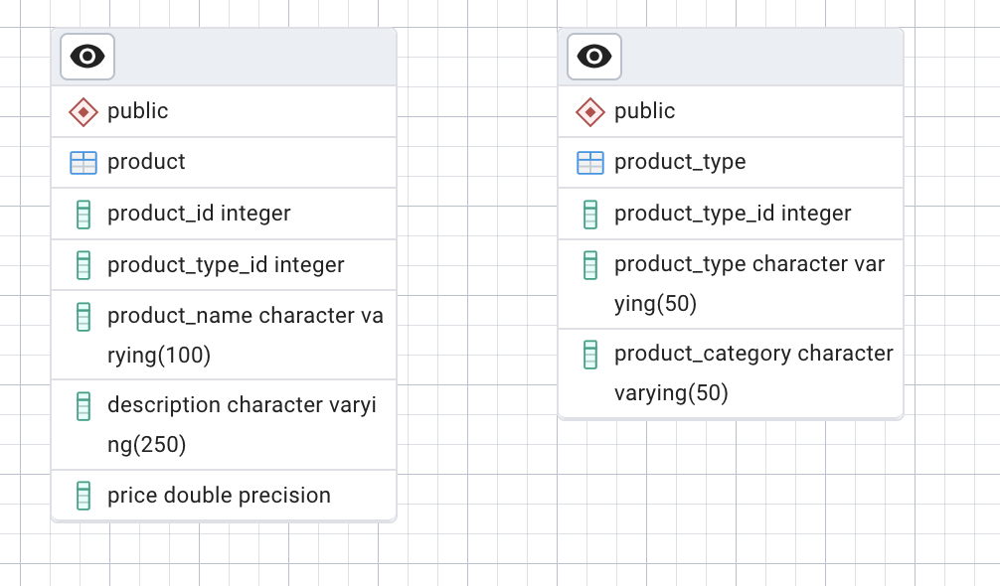</kbd>

### Task 5: Define keys and relationships <a href="#readme-top">🔝</a>
After normalizing your tables, you can define their primary keys and relationships between the tables in your ERD.  
1. Identify an appropriate column in each table to be a primary key and create the primary keys in the tables in your entity-relationship diagram (ERD).

:ballot_box_with_check: ***Solution:***  
<kbd>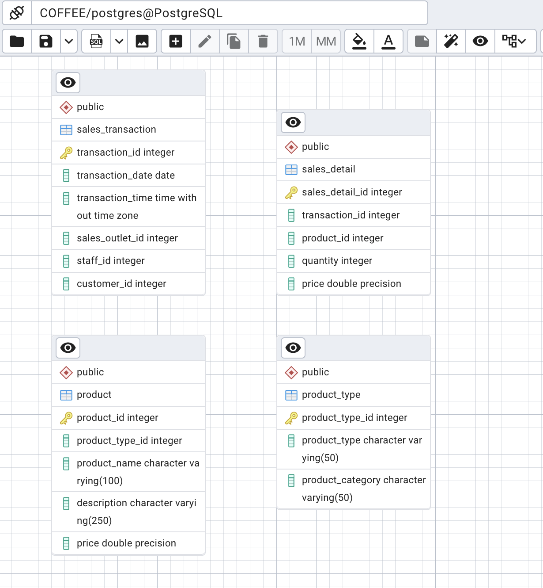</kbd>

2. Identify the relationships between the following pairs of tables and then create the relationships in your ERD:
   - `sales_detail` to `sales_transaction`
   - `sales_detail` to `product`
   - `product` to `product_type`

:ballot_box_with_check: ***Solution:***  
<kbd></kbd>

### Task 6: Create database objects by generating and running the SQL script from the ERD tool <a href="#readme-top">🔝</a>
Now that your design is complete, you will generate an SQL script from your ERD, which you can use to create your database schema. For this project, you will then use a given SQL script to ensure that you can load the sample data into the schema. Finally, you will load the existing data from various sources into your new database schema.  
1. Use the Generate SQL functionality in the ERD tool to create an SQL script from your ERD.
2. Download the following `GeneratedScript.sql`.
3. In pgAdmin, open the query tool, upload and open the `GeneratedScript.sql` file from your local computer, and then run the script to create the tables defined in the ERD. Verify that the tables exist in the COFFEE database’s public schema now.

:ballot_box_with_check: ***Solution:***  
<kbd>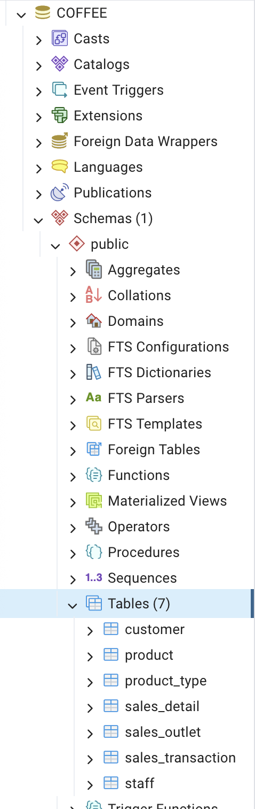</kbd>

4. Download the following `CoffeeData.sql`.
5. In pgAdmin, open another instance of the Query tool, upload and open the `CoffeeData.sql` file from your local computer, and then run the script to populate the tables you just created.
6. In pgAdmin, view the first 100 rows of the `sales_detail` table.

:ballot_box_with_check: ***Solution:***  
<kbd>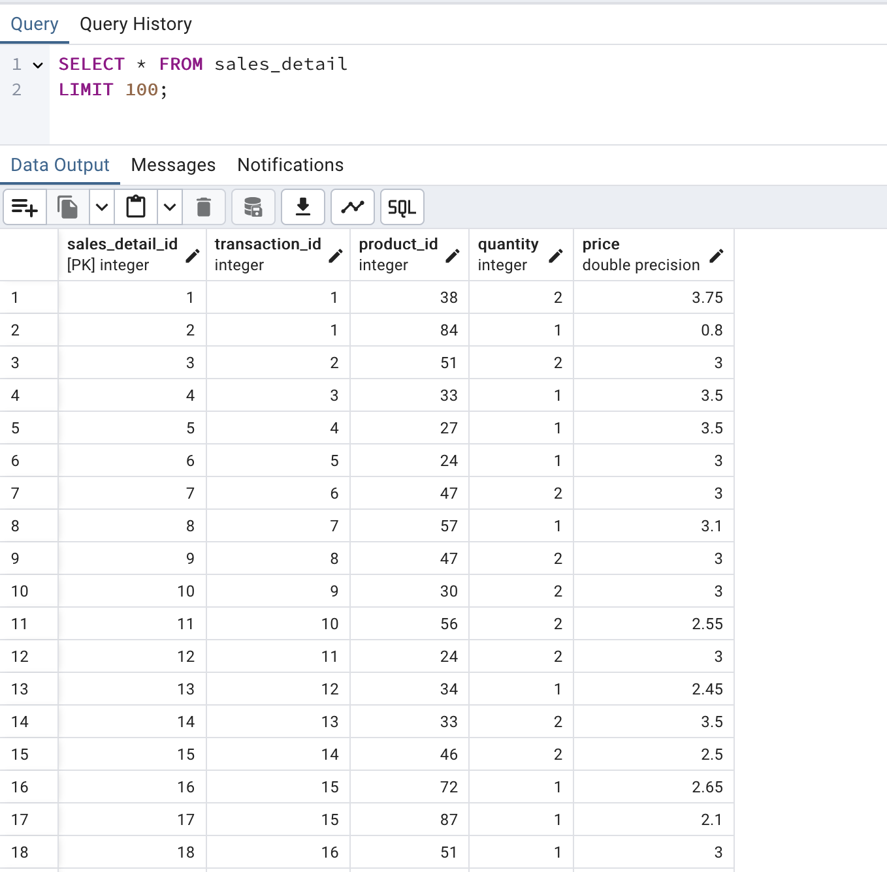</kbd>

### Task 7: Create a view and export the data <a href="#readme-top">🔝</a>
The external payroll company has requested a list of employees and the locations at which they work. This list should not include the CEO or CFO who owns the company. In this task, you will create a view in your PostgreSQL database that returns this information and export the results to a CSV file.  
In your `COFFEE` database, create a new view named `staff_locations_view` using the following SQL, then save the query results to a file named `staff_locations_view.csv`.
```SQL
SELECT staff.staff_id,
staff.first_name,
staff.last_name,
staff.location
FROM staff
WHERE "position" NOT IN ('CEO', 'CFO');
```

:ballot_box_with_check: ***Solution:***  
<kbd>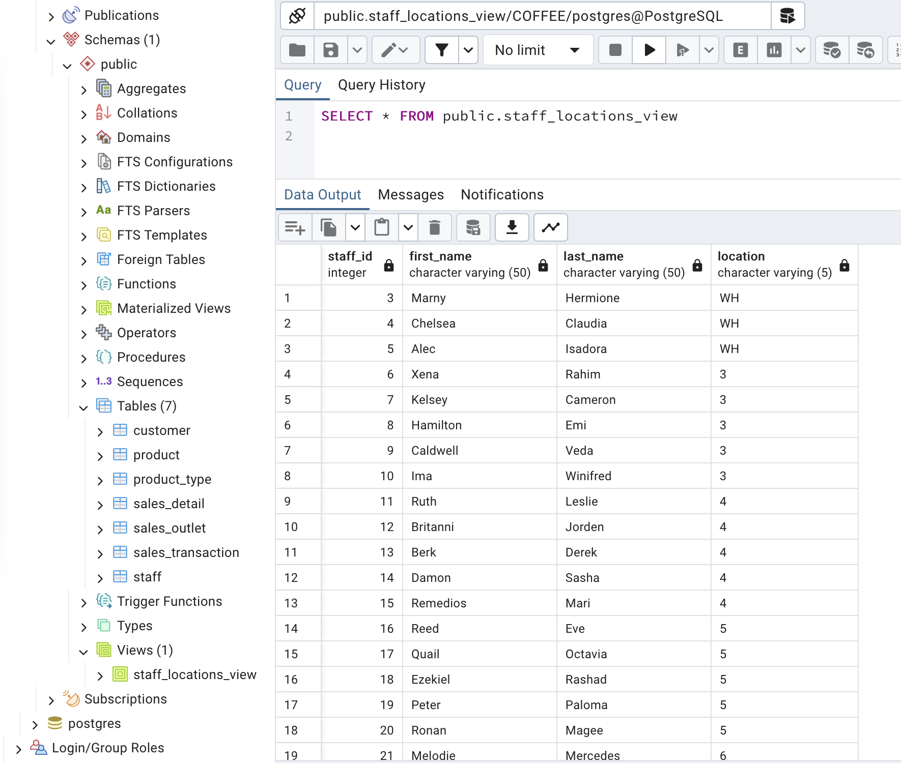</kbd>

### Task 8: Create a materialized view and export the data <a href="#readme-top">🔝</a>
A marketing consultant requires access to your product data in their MySQL database for a marketing campaign. You will create a materialized view in your PostgreSQL database that returns this information and export the results to a CSV file.  
In your `COFFEE` database, create a new materialized view named `product_info_m-view` using the following SQL, then save the query results to a file named `product_info_m-view.csv`.
```SQL
SELECT product.product_name, product.description, product_type.product_category
FROM product
JOIN product_type
ON product.product_type_id = product_type.product_type_id;
```

:ballot_box_with_check: ***Solution:***  
<kbd>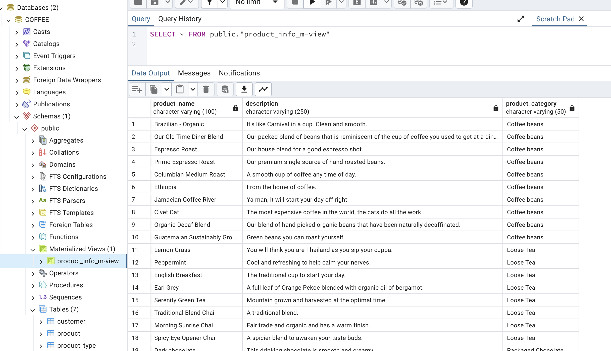</kbd>

### Task 9: Import staff_location data into a MySQL database <a href="#readme-top">🔝</a>
The external payroll company has asked you to upload the staff location information to their MySQL database.   
In phpMyAdmin, create a new database named `STAFF_LOCATIONS`, then import the location information saved in the `staff_locations_view.csv` file you exported from the view you created in Task 7.

:ballot_box_with_check: ***Solution:***  
<kbd>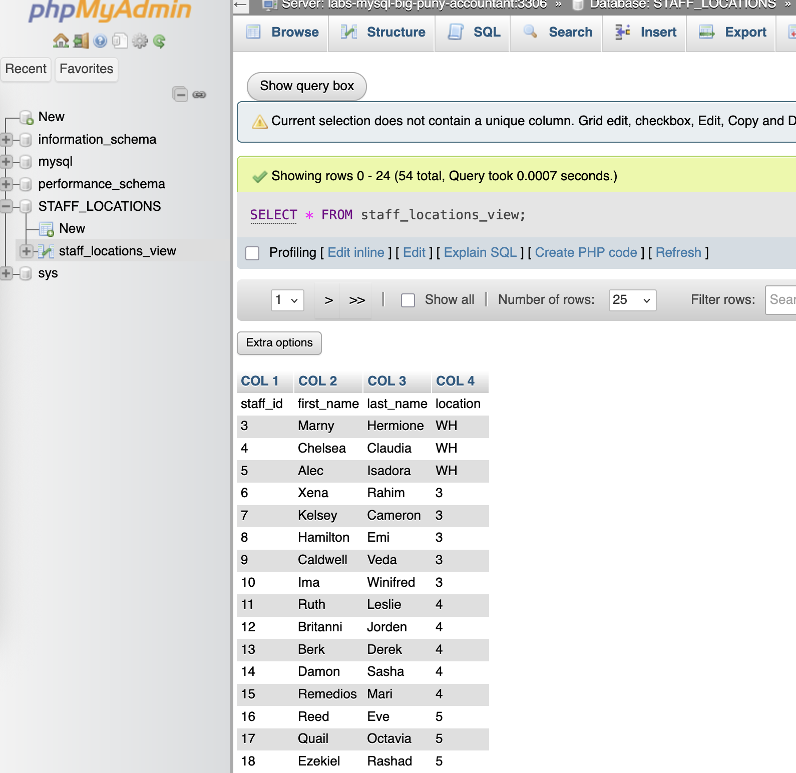</kbd>

### Task 10: Import coffee_shop_products data into a MySQL database <a href="#readme-top">🔝</a>
The marketing consultant has asked you to upload the product information to their MySQL database.  
In phpMyAdmin, create a new database named `coffee_shop_products`, and then import the product information saved in the `product_info_m-view.csv` file from your materialized view created in Task 8 into a new table in the `coffee_shop_products` database.

:ballot_box_with_check: ***Solution:***  
<kbd>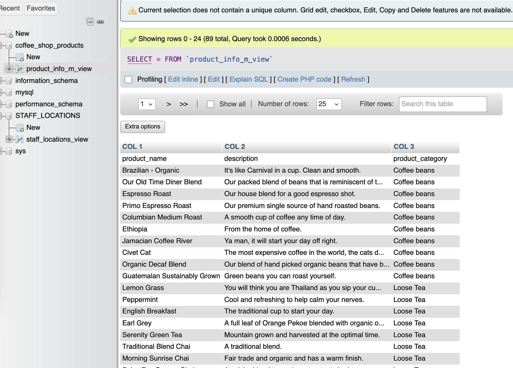</kbd>


